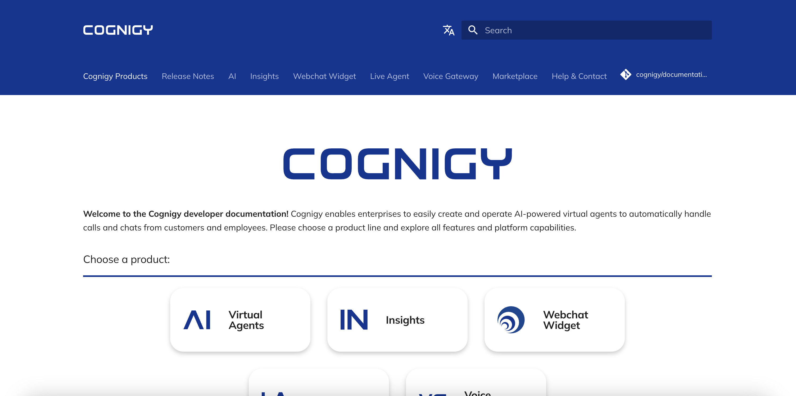

# Overview

This repository is home for Cognigy's brand-new product documentation which is hosted on [docs.cognigy.com](https://docs.cognigy.com).

The repository stores documentation for all Cognigy products like Cognigy.AI, Cognigy Insights and the Cognigy WebchatWidget. Documentation is written as Markdown files and compiled to static HTML using the [MKDocs framework](https://www.mkdocs.org/).

We use a modified theme based on [mkdocs-material](https://squidfunk.github.io/mkdocs-material/) which we have extended in order to match our own corporate identity.

# Contribution
You want to contribute to the contents shown on https://docs.cognigy.com and want to help us improve the documentation? Great - check the [contribution](/contribution) folder for more info!