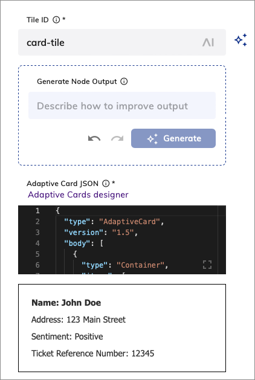

# Copilot: Adaptive Card Tile

<figure>
  
</figure>

## Description

This Node allows you to create and display adaptive cards in your AI Copilot Workspace. Adaptive cards can display rich content and interactive elements, such as images, text, buttons, and forms. 

The [Adaptive Card Designer](https://adaptivecards.io/designer) can help you to define an Adaptive Card. Copy the JSON card payload and paste it into the form.

### Create an Adaptive Card with Generative AI

{! _includes/ai/nodes/adaptive-card-genai.md !}

<figure>
  
</figure>

## Settings 

| Parameter            | Type          | Description                                                                                    |
|----------------------|---------------|------------------------------------------------------------------------------------------------|
| Tile ID              | CognigyScript | The ID that you created in the AI Copilot configuration.                                       |
| Generate Node Output | Text          | A prompt or instruction for generating the Adaptive Card. To apply the prompt, click Generate. |
| Adaptive Card JSON   | HTML          | The Adaptive Card JSON payload to render inside the tile.                                      |
| JSON Data            | JSON          | The Data to send to the IFrame as a postMessage event.                                         |

## More Information

- [Copilot: HTML file](set-html-tile.md)
- [Copilot: IFrame tile](set-iframe-tile.md)
- [Copilot: Set Grid](set-grid.md)
- [AI Copilot Nodes](overview.md)
- [AI Copilot](../../../../ai-copilot/overview.md)