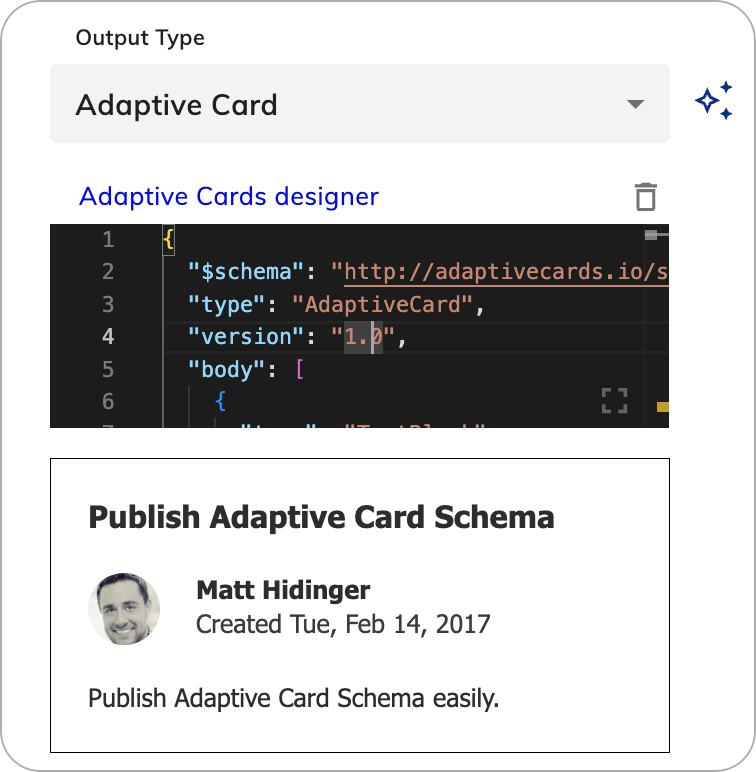

# Say

<figure>
  
</figure>

## Description

A Say Node is used to send a message to the user.

Depending on the current Channel, additional rich media formats are available. Add a new channel output by clicking the **+** icon and selecting the channel that corresponds to the channel endpoint that will be deployed.

## Settings

### Channels

list all channels


### Output Type 

The AI Channel allows for the configuration of different **Output Types**. Not all [endpoints](../../../deploy/endpoints/overview.md) can correctly convert your content to the desired output type. Before configuration, [check the compatibility](../../../deploy/endpoints/content-conversion.md) of the output type with the endpoint.

#### Text

The **Text** Output Type renders text and emojis (if supported by the channel). The text field also supports [CognigyScript](../../cognigy-script.md) and [Tokens](../../tokens.md) that can be added by clicking the **AI** button at the end of each field.

Multiple text messages can be added for conversational variation.
When multiple text messages are configured,
the delivery order is controlled by the *linear* and *loop* settings available in the ***options*** dropdown menu.

By configuring multiple messages in a text say node, only one message will be delivered per activation of the node.
An additional say node must be configured in order to send two text messages at once.

Keep in mind that **emojis** may not render properly on all channels.

| Parameters | Type          | Description                                          |
|------------|---------------|------------------------------------------------------|
| Text       | CognigyScript | Enter the text. Does not support markdown, only html |

##### Options

When you send text responses, you can control how the text is delivered and attach additional data to the message. The following options are available for configuring the behavior:

| Parameter | Type   | Description                                                                                                                                                                                                                                                           |
|-----------|--------|-----------------------------------------------------------------------------------------------------------------------------------------------------------------------------------------------------------------------------------------------------------------------|
| Linear    | Toggle | Controls whether the text responses are shown in a specific order (linearly) or randomly. If enabled, the text options are presented one after the other in the defined sequence.                                                                                     |
| Loop      | Toggle | Works in conjunction with the **Linear** option. If **Linear** is enabled and **Loop** is also enabled, the sequence starts over from the beginning after reaching the end. If **Loop** is disabled, the last text option will keep repeating after reaching the end. |
| Data      | JSON   | Allows you to include additional data that you want to send along with the message to the client. For example, `{ "type": "motivational" }`.                                                                                                                          |

When configuring the Linear and Loop parameters, you can achieve different message delivery behavior:

| Scenario             | Configuration            | Example Conversation                                                                                                                                                                                                                                                                                                                                                                           |
|----------------------|--------------------------|------------------------------------------------------------------------------------------------------------------------------------------------------------------------------------------------------------------------------------------------------------------------------------------------------------------------------------------------------------------------------------------------|
| Random Behavior      | Linear: Off<br>Loop: Off | User: `Give me some motivation.`<br>AI Agent: `You are doing great!`<br>User: `Another one, please.`<br>AI Agent: `Believe in yourself!`<br>User: `More motivation.`<br>AI Agent: `Keep pushing forward!`<br><br>Responses are in random order each time.                                                                                                                                      |
| Linear + Non-looping | Linear: On<br>Loop: Off  | User: `Give me some motivation.`<br>AI Agent: `Keep pushing forward!`<br>User: `Another one, please.`<br>AI Agent: `Believe in yourself!`<br>User: `More motivation.`<br>AI Agent: `You are doing great!`<br>User: `One more, please.`<br>AI Agent: `You are doing great!` (repeats last message)<br><br>Responses follow a fixed sequence and repeat the last message after reaching the end. |
| Linear + Looping     | Linear: On<br>Loop: On   | User: `Give me some motivation.`<br>AI Agent: `Keep pushing forward!`<br>User: `Another one, please.`<br>AI Agent: `Believe in yourself!`<br>User: `More motivation.`<br>AI Agent: `You are doing great!`<br>User: `Next!`<br>AI Agent: `Keep pushing forward!` (starts sequence over)<br><br>Responses cycle through in a fixed order and restart from the beginning after reaching the end.  |

#### Text with Quick Replies

!!! warning "Channel Support"
    The **Text with Quick Replies** Output Type is currently converted to compatible output on all the following channels: **Webchat**, **Messenger**, **Line**, **Azure Bot Service**, **Sunshine Conversations**, **Slack** and **RingCentral Engage**.


Text with Quick Replies can be used to show the user a number of configurable Quick Replies. Quick Replies are pre-defined answers that are rendered as input chips.

| Parameters                | Type           | Description                                                                                                                                                                                                                                                                                                                                                                                                                                                                                                                                                                                                                                                                                                                                                                            |
|---------------------------|----------------|----------------------------------------------------------------------------------------------------------------------------------------------------------------------------------------------------------------------------------------------------------------------------------------------------------------------------------------------------------------------------------------------------------------------------------------------------------------------------------------------------------------------------------------------------------------------------------------------------------------------------------------------------------------------------------------------------------------------------------------------------------------------------------------|
| Text                      | CognigyScript  | Enter the text. Does not support markdown, only html                                                                                                                                                                                                                                                                                                                                                                                                                                                                                                                                                                                                                                                                                                                                   |
| Add Quick Reply           | Button         |                                                                                                                                                                                                                                                                                                                                                                                                                                                                                                                                                                                                                                                                                                                                                                                        |
| Empty Quick Reply         | Button         |                                                                                                                                                                                                                                                                                                                                                                                                                                                                                                                                                                                                                                                                                                                                                                                        |
| Button Title              | CognigyScript  |                                                                                                                                                                                                                                                                                                                                                                                                                                                                                                                                                                                                                                                                                                                                                                                        |
| Select Button Type        | Dropdown       | - Postback Value - when a **Postback Value** is configured and the **Quick Reply** is clicked, the Postback Value will be sent to the start of the Flow. This simulates user input - it is "as if" the user would have manually typed something. This is the most typical behavior for Quick Replies.<br>- Phone Number - when this option is configured, clicking the Quick Reply will try to open the phone application on the device.<br>- Trigger Intent - the Trigger Intent feature allows you to manually trigger an Intent by writing cIntent:, followed by the desired intent name in your text input, the regular Intent mapping will be ignored. More information see [Trigger Intent](../../../empower/nlu/intents/trigger-intent.md)<br>- Open xApp - opens an xApp page. |
| Postback Value            | CognigyScript  | Appears when Postback Value in Select Button Type is chosen.                                                                                                                                                                                                                                                                                                                                                                                                                                                                                                                                                                                                                                                                                                                           |
| Phone number              | CognigyScript  | Appears when Phone Number in Select Button Type is chosen.                                                                                                                                                                                                                                                                                                                                                                                                                                                                                                                                                                                                                                                                                                                             |                                                                                                                                                                                                                                                               
| Intent Name               | CognigyScript  | Appears when Intent Name in Select Button Type is chosen.                                                                                                                                                                                                                                                                                                                                                                                                                                                                                                                                                                                                                                                                                                                              |
| Image URL                 | CognigyScript  |                                                                                                                                                                                                                                                                                                                                                                                                                                                                                                                                                                                                                                                                                                                                                                                        |
| Image Alternate Text      | CognigyScript  |                                                                                                                                                                                                                                                                                                                                                                                                                                                                                                                                                                                                                                                                                                                                                                                        |                                                                                                                                                                                                                                                                                                                                                                                                                                                                                                                                                                                                                                                                                                                                                                                       
| Condition: Cognigy Script | CognigyScript  |                                                                                                                                                                                                                                                                                                                                                                                                                                                                                                                                                                                                                                                                                                                                                                                        |                                                                                                                                                                                                                                                                                                                                                                                                                                                                                                                                                                                                                                                                                                                                                                                       
| Fallback Text             | CognigyScript  |                                                                                                                                                                                                                                                                                                                                                                                                                                                                                                                                                                                                                                                                                                                                                                                        | 

#### Gallery

Galleries are powerful visual widgets that are ideal for showing a list of options with images. They are typically used to show a number of products or other items that can be browsed.

A gallery can be configured with a number of cards. A card contains an image, a title and a subtitle and can be configured with (optional) buttons.

!!! warning "Channel Support"
    The **Gallery** Output Type is currently converted to compatible output on all the following channels: **Webchat**, **Messenger**, **Line**, **Azure Bot Service**, **Sunshine Conversations**, **Slack** and **RingCentral Engage**.

##### Card

| Parameters                | Type          | Description                                                                                                                                                                                                                                                                                                                                                                                                                                                                                                                                                                                                                                                                                                                                                                            |
|---------------------------|---------------|----------------------------------------------------------------------------------------------------------------------------------------------------------------------------------------------------------------------------------------------------------------------------------------------------------------------------------------------------------------------------------------------------------------------------------------------------------------------------------------------------------------------------------------------------------------------------------------------------------------------------------------------------------------------------------------------------------------------------------------------------------------------------------------|
| Add Card                  | Button        | Adds a new card for the Gallery type. You can add multiple cards.                                                                                                                                                                                                                                                                                                                                                                                                                                                                                                                                                                                                                                                                                                                      |
| Add Image                 | Button        | Adds an image for the selected card.                                                                                                                                                                                                                                                                                                                                                                                                                                                                                                                                                                                                                                                                                                                                                   |
| Image URL                 | Button        | Appears when the Add Image parameter is selected. The URL for the image. Note if you upload a URL to a storagem such as Google Cloud Storage, AWS stoorage, that the URL should be publicly available.                                                                                                                                                                                                                                                                                                                                                                                                                                                                                                                                                                                 |
| Image Alternate Text      | CognigyScript | Appears when the Add Image parameter is selected. The text that will be visible if the image is not available.                                                                                                                                                                                                                                                                                                                                                                                                                                                                                                                                                                                                                                                                         |
| Title                     | CognigyScript | Appears when the Add Card parameter is selected. The title of the card.                                                                                                                                                                                                                                                                                                                                                                                                                                                                                                                                                                                                                                                                                                                | 
| Subtitle                  | CognigyScript | Appears when the Add Card parameter is selected. The subtitle of the card.                                                                                                                                                                                                                                                                                                                                                                                                                                                                                                                                                                                                                                                                                                             |
| Condition: Cognigy Script | CognigyScript | Allows to control when cards are shown or hidden based on conditions written in CognigyScript. If you're displaying cards in a Gallery and only want to show a card when there's data, use this condition: `{{ "{{context.array.length > 0}}" }}`. It checks if the array has items (length is greater than 0). If true, the card will appear; if false, it stays hidden.                                                                                                                                                                                                                                                                                                                                                                                                              |
| Fallback Text             | CognigyScript | The text that will appear if the Gallery will not be rendered in the chat.                                                                                                                                                                                                                                                                                                                                                                                                                                                                                                                                                                                                                                                                                                             | 

##### Button

| Parameters                | Type          | Description                                                                                                                                                                                                                                                                                                                                                                                                                                                                                                                                                                                                                                                                                                                                                                            |
|---------------------------|---------------|----------------------------------------------------------------------------------------------------------------------------------------------------------------------------------------------------------------------------------------------------------------------------------------------------------------------------------------------------------------------------------------------------------------------------------------------------------------------------------------------------------------------------------------------------------------------------------------------------------------------------------------------------------------------------------------------------------------------------------------------------------------------------------------|
| Add Button                | Button        | Adds a new Empty Title button. You can add multiple buttons.                                                                                                                                                                                                                                                                                                                                                                                                                                                                                                                                                                                                                                                                                                                           |
| Empty Title               | Button        | Adds a new button to the selected card.                                                                                                                                                                                                                                                                                                                                                                                                                                                                                                                                                                                                                                                                                                                                                |
| Button Title              | Button        | Appears only when the Empty Title parameter is selected. The title of the button.                                                                                                                                                                                                                                                                                                                                                                                                                                                                                                                                                                                                                                                                                                      |
| Select Button Type        | Dropdown      | - Postback Value - when a **Postback Value** is configured and the **Quick Reply** is clicked, the Postback Value will be sent to the start of the Flow. This simulates user input - it is "as if" the user would have manually typed something. This is the most typical behavior for Quick Replies.<br>- Phone Number - when this option is configured, clicking the Quick Reply will try to open the phone application on the device.<br>- Trigger Intent - the Trigger Intent feature allows you to manually trigger an Intent by writing cIntent:, followed by the desired intent name in your text input, the regular Intent mapping will be ignored. More information see [Trigger Intent](../../../empower/nlu/intents/trigger-intent.md)<br>- Open xApp - opens an xApp page. |
| Postback Value            | CognigyScript | Appears if the Post back value is selected.                                                                                                                                                                                                                                                                                                                                                                                                                                                                                                                                                                                                                                                                                                                                            |
| URL                       | CognigyScript | Appears if the URL value in Select Button Type   is selected.                                                                                                                                                                                                                                                                                                                                                                                                                                                                                                                                                                                                                                                                                                                          |
| URL Target                | CognigyScript | Appears if the URL value in Select Button Type is selected. You can select one of the following options: Open URL in a new tab - Open URL in the same tab                                                                                                                                                                                                                                                                                                                                                                                                                                                                                                                                                                                                                              |
| Phone number              | CognigyScript | Appears if the URL value in Select Button Type is selected.                                                                                                                                                                                                                                                                                                                                                                                                                                                                                                                                                                                                                                                                                                                            |
| Intent name               | CognigyScript | Appears if the Trigger Intent value in Select Button Type is selected.                                                                                                                                                                                                                                                                                                                                                                                                                                                                                                                                                                                                                                                                                                                 |
| Condition: Cognigy Script | CognigyScript | Allows to control when buttons are shown or hidden based on conditions written in CognigyScript. If you're displaying buttons in a card and only want to show a  when there's data, use this condition: `{{ "{{context.array.length > 0}}" }}`. It checks if the array has items (length is greater than 0). If true, the button will appear; if false, it stays hidden.                                                                                                                                                                                                                                                                                                                                                                                                               |

#### Text with Buttons

**Text with Buttons** is a similar **Output Type** to **Text with Quick Replies**. The difference comes from the way the widget is rendered, which resembles a vertical list of button options. It can be configured in a similar fashion.

##### Text

| Parameters                | Type          | Description                                                                                                                                                                                                                                                                                                                                                                                                                                                                                                                                                                                                                                                                                                                                                                            |
|---------------------------|---------------|----------------------------------------------------------------------------------------------------------------------------------------------------------------------------------------------------------------------------------------------------------------------------------------------------------------------------------------------------------------------------------------------------------------------------------------------------------------------------------------------------------------------------------------------------------------------------------------------------------------------------------------------------------------------------------------------------------------------------------------------------------------------------------------|
| Text                      | CognigyScript | Enter the text. Does not support markdown, only html.                                                                                                                                                                                                                                                                                                                                                                                                                                                                                                                                                                                                                                                                                                                                  |
| Fallback Text             | CognigyScript | The text that will appear if the  Text with Buttons  will not be rendered in the chat.                                                                                                                                                                                                                                                                                                                                                                                                                                                                                                                                                                                                                                                                                                 | 

##### Button

| Parameters                | Type          | Description                                                                                                                                                                                                                                                                                                                                                                                                                                                                                                                                                                                                                                                                                                                                                                            |
|---------------------------|---------------|----------------------------------------------------------------------------------------------------------------------------------------------------------------------------------------------------------------------------------------------------------------------------------------------------------------------------------------------------------------------------------------------------------------------------------------------------------------------------------------------------------------------------------------------------------------------------------------------------------------------------------------------------------------------------------------------------------------------------------------------------------------------------------------|
| Add Button                | Button        | Adds a new Empty Title button. You can add up to 6 buttons.                                                                                                                                                                                                                                                                                                                                                                                                                                                                                                                                                                                                                                                                                                                            |
| Empty Title               | Button        | Adds a new button to the selected card.                                                                                                                                                                                                                                                                                                                                                                                                                                                                                                                                                                                                                                                                                                                                                |
| Button Title              | Button        | Appears only when the Empty Title parameter is selected. The title of the button.                                                                                                                                                                                                                                                                                                                                                                                                                                                                                                                                                                                                                                                                                                      |
| Select Button Type        | Dropdown      | - Postback Value - when a **Postback Value** is configured and the **Quick Reply** is clicked, the Postback Value will be sent to the start of the Flow. This simulates user input - it is "as if" the user would have manually typed something. This is the most typical behavior for Quick Replies.<br>- Phone Number - when this option is configured, clicking the Quick Reply will try to open the phone application on the device.<br>- Trigger Intent - the Trigger Intent feature allows you to manually trigger an Intent by writing cIntent:, followed by the desired intent name in your text input, the regular Intent mapping will be ignored. More information see [Trigger Intent](../../../empower/nlu/intents/trigger-intent.md)<br>- Open xApp - opens an xApp page. |
| Postback Value            | CognigyScript | Appears if the Post back value is selected.                                                                                                                                                                                                                                                                                                                                                                                                                                                                                                                                                                                                                                                                                                                                            |
| URL                       | CognigyScript | Appears if the URL value in Select Button Type   is selected.                                                                                                                                                                                                                                                                                                                                                                                                                                                                                                                                                                                                                                                                                                                          |
| URL Target                | CognigyScript | Appears if the URL value in Select Button Type is selected. You can select one of the following options: Open URL in a new tab - Open URL in the same tab                                                                                                                                                                                                                                                                                                                                                                                                                                                                                                                                                                                                                              |
| Phone number              | CognigyScript | Appears if the URL value in Select Button Type is selected.                                                                                                                                                                                                                                                                                                                                                                                                                                                                                                                                                                                                                                                                                                                            |
| Intent name               | CognigyScript | Appears if the Trigger Intent value in Select Button Type is selected.                                                                                                                                                                                                                                                                                                                                                                                                                                                                                                                                                                                                                                                                                                                 |
| Condition: Cognigy Script | CognigyScript | Allows to control when buttons are shown or hidden based on conditions written in CognigyScript. If you're displaying buttons in a card and only want to show a  when there's data, use this condition: `{{ "{{context.array.length > 0}}" }}`. It checks if the array has items (length is greater than 0). If true, the button will appear; if false, it stays hidden.                                                                                                                                                                                                                                                                                                                                                                                                               |

#### List

**List** output allows a customized list of items to be displayed with many configuration options such as the header image, buttons, images and more.

The first list item can optionally be converted to a header item that houses the list title, subtitle and button. Each additional list item can have a title, subtitle, image and button added. The list can also have a button added at the bottom.

##### Item

| Parameters           | Type          | Description                                                                                                                                                                                                                                                                                                                                                            |
|----------------------|---------------|------------------------------------------------------------------------------------------------------------------------------------------------------------------------------------------------------------------------------------------------------------------------------------------------------------------------------------------------------------------------|
| Add item             | Button        | Adds a new Empty Title button to the selected card. You can add up 10 items.                                                                                                                                                                                                                                                                                           |
| Empty Title          | Button        | Adds a new entry to the list.                                                                                                                                                                                                                                                                                                                                          |
| Title                | CognigyScript | Appears when you select **Empty Title**.                                                                                                                                                                                                                                                                                                                               |
| Subtitle             | CognigyScript | Appears when the Add Card parameter is selected. The subtitle of the card.                                                                                                                                                                                                                                                                                             |
| Image URL            | Button        | Appears when the Add Image parameter is selected. The URL for the image. Note if you upload a URL to a storagem such as Google Cloud Storage, AWS stoorage, that the URL should be publicly available.                                                                                                                                                                 |
| Image Alternate Text | CognigyScript | Appears when the Add Image parameter is selected. The text that will be visible if the image is not available.                                                                                                                                                                                                                                                         |
| Default Action URL   | CognigyScript | Appears when the Empty Title parameter is selected. It is a link that opens when the user clicks anywhere on the item. It's used when you want the entire item to be clickable, directing the user to a specific website or resource.                                                                                                                                  |
| Condition            | CognigyScript | Allows to control when items are shown or hidden based on conditions written in CognigyScript. If you're displaying items in a list and only want to show a list when there's data, use this condition: `{{ "{{context.array.length > 0}}" }}`. It checks if the array has items (length is greater than 0). If true, the item will appear; if false, it stays hidden. |
| Fallback Text        | CognigyScript | The text that will appear if the  Text with Buttons  will not be rendered in the chat.                                                                                                                                                                                                                                                                                 | 

###### Item Button

Each item can have a separate button.
To configure it, hover the mouse over the Empty Title and click **+** icon.
You can add only one button per item.

| Parameters                | Type          | Description                                                                                                                                                                                                                                                                                                                                                                                                                                                                                                                                                                                                                                                                                                                                                                            |
|---------------------------|---------------|----------------------------------------------------------------------------------------------------------------------------------------------------------------------------------------------------------------------------------------------------------------------------------------------------------------------------------------------------------------------------------------------------------------------------------------------------------------------------------------------------------------------------------------------------------------------------------------------------------------------------------------------------------------------------------------------------------------------------------------------------------------------------------------|
| Button Title              | Button        | Appears only when the Empty Title parameter is selected. The title of the button.                                                                                                                                                                                                                                                                                                                                                                                                                                                                                                                                                                                                                                                                                                      |
| Select Button Type        | Dropdown      | - Postback Value - when a **Postback Value** is configured and the **Quick Reply** is clicked, the Postback Value will be sent to the start of the Flow. This simulates user input - it is "as if" the user would have manually typed something. This is the most typical behavior for Quick Replies.<br>- Phone Number - when this option is configured, clicking the Quick Reply will try to open the phone application on the device.<br>- Trigger Intent - the Trigger Intent feature allows you to manually trigger an Intent by writing cIntent:, followed by the desired intent name in your text input, the regular Intent mapping will be ignored. More information see [Trigger Intent](../../../empower/nlu/intents/trigger-intent.md)<br>- Open xApp - opens an xApp page. |
| Postback Value            | CognigyScript | Appears if the Post back value is selected.                                                                                                                                                                                                                                                                                                                                                                                                                                                                                                                                                                                                                                                                                                                                            |
| URL                       | CognigyScript | Appears if the URL value in Select Button Type   is selected.                                                                                                                                                                                                                                                                                                                                                                                                                                                                                                                                                                                                                                                                                                                          |
| URL Target                | CognigyScript | Appears if the URL value in Select Button Type is selected. You can select one of the following options: Open URL in a new tab - Open URL in the same tab                                                                                                                                                                                                                                                                                                                                                                                                                                                                                                                                                                                                                              |
| Phone number              | CognigyScript | Appears if the URL value in Select Button Type is selected.                                                                                                                                                                                                                                                                                                                                                                                                                                                                                                                                                                                                                                                                                                                            |
| Intent name               | CognigyScript | Appears if the Trigger Intent value in Select Button Type is selected.                                                                                                                                                                                                                                                                                                                                                                                                                                                                                                                                                                                                                                                                                                                 |
| Condition: Cognigy Script | CognigyScript | Allows to control when buttons are shown or hidden based on conditions written in CognigyScript. If you're displaying buttons in a card and only want to show a  when there's data, use this condition: `{{ "{{context.array.length > 0}}" }}`. It checks if the array has items (length is greater than 0). If true, the button will appear; if false, it stays hidden.                                                                                                                                                                                                                                                                                                                                                                                                               |

##### Button

You can add only one item for the list.

| Parameters                | Type          | Description                                                                                                                                                                                                                                                                                                                                                                                                                                                                                                                                                                                                                                                                                                                                                                            |
|---------------------------|---------------|----------------------------------------------------------------------------------------------------------------------------------------------------------------------------------------------------------------------------------------------------------------------------------------------------------------------------------------------------------------------------------------------------------------------------------------------------------------------------------------------------------------------------------------------------------------------------------------------------------------------------------------------------------------------------------------------------------------------------------------------------------------------------------------|
| Add Button                | Button        | Adds a new Empty Title button. You can add up to 6 buttons.                                                                                                                                                                                                                                                                                                                                                                                                                                                                                                                                                                                                                                                                                                                            |
| Empty Title               | Button        | Adds a new button to the selected card.                                                                                                                                                                                                                                                                                                                                                                                                                                                                                                                                                                                                                                                                                                                                                |
| Button Title              | Button        | Appears only when the Empty Title parameter is selected. The title of the button.                                                                                                                                                                                                                                                                                                                                                                                                                                                                                                                                                                                                                                                                                                      |
| Select Button Type        | Dropdown      | - Postback Value - when a **Postback Value** is configured and the **Quick Reply** is clicked, the Postback Value will be sent to the start of the Flow. This simulates user input - it is "as if" the user would have manually typed something. This is the most typical behavior for Quick Replies.<br>- Phone Number - when this option is configured, clicking the Quick Reply will try to open the phone application on the device.<br>- Trigger Intent - the Trigger Intent feature allows you to manually trigger an Intent by writing cIntent:, followed by the desired intent name in your text input, the regular Intent mapping will be ignored. More information see [Trigger Intent](../../../empower/nlu/intents/trigger-intent.md)<br>- Open xApp - opens an xApp page. |
| Postback Value            | CognigyScript | Appears if the Post back value is selected.                                                                                                                                                                                                                                                                                                                                                                                                                                                                                                                                                                                                                                                                                                                                            |
| URL                       | CognigyScript | Appears if the URL value in Select Button Type   is selected.                                                                                                                                                                                                                                                                                                                                                                                                                                                                                                                                                                                                                                                                                                                          |
| URL Target                | CognigyScript | Appears if the URL value in Select Button Type is selected. You can select one of the following options: Open URL in a new tab - Open URL in the same tab                                                                                                                                                                                                                                                                                                                                                                                                                                                                                                                                                                                                                              |
| Phone number              | CognigyScript | Appears if the URL value in Select Button Type is selected.                                                                                                                                                                                                                                                                                                                                                                                                                                                                                                                                                                                                                                                                                                                            |
| Intent name               | CognigyScript | Appears if the Trigger Intent value in Select Button Type is selected.                                                                                                                                                                                                                                                                                                                                                                                                                                                                                                                                                                                                                                                                                                                 |
| Condition: Cognigy Script | CognigyScript | Allows to control when buttons are shown or hidden based on conditions written in CognigyScript. If you're displaying buttons in a card and only want to show a  when there's data, use this condition: `{{ "{{context.array.length > 0}}" }}`. It checks if the array has items (length is greater than 0). If true, the button will appear; if false, it stays hidden.                                                                                                                                                                                                                                                                                                                                                                                                               |

#### Audio

The **Audio Output Type** can render audio output in case this is supported by the channel. It can be configured, by providing it with a URL to an audio file.

| Parameters           | Type          | Description                                                                                                                                            |
|----------------------|---------------|--------------------------------------------------------------------------------------------------------------------------------------------------------|
| Audio URL            | CognigyScript | The URL fo the track that you want to pla. Note that the URL should be publicly available.                                                             |
| Audio Alternate Text | CognigyScript | The Audio transcript that you can add an addition to the audi to allow users to download it. This field is applicable only to the Webchat v3 Endpoint. |
| Fallback Text        | CognigyScript | The text that will appear if the  Text with Buttons  will not be rendered in the chat.                                                                 | 

#### Image

Image Output Types display an image in a similar fashion to the gallery. The image output, however, only outputs one particular image.

| Parameters           | Type          | Description                                                                                                                                                                                            |
|----------------------|---------------|--------------------------------------------------------------------------------------------------------------------------------------------------------------------------------------------------------|
| Image URL            | Button        | Appears when the Add Image parameter is selected. The URL for the image. Note if you upload a URL to a storagem such as Google Cloud Storage, AWS stoorage, that the URL should be publicly available. |
| Image Alternate Text | CognigyScript | Appears when the Add Image parameter is selected. The text that will be visible if the image is not available.                                                                                         |
| Fallback Text        | CognigyScript | The text that will appear if the  Text with Buttons  will not be rendered in the chat.                                                                                                                 | 

#### Video

The Video Output Type allows you to configure a video output. It takes a URL as an input parameter and will start playing the video automatically if this is supported by the channel.


| Parameters           | Type          | Description                                                                                                                                                                                                                                      |
|----------------------|---------------|--------------------------------------------------------------------------------------------------------------------------------------------------------------------------------------------------------------------------------------------------|
| Video URL            | Button        | The URL fo the track that you want to pla. Note that the URL should be publicly available.                                                                                                                                                       |
| Video Alternate Text | CognigyScript | The Video transcript that you can add an addition to the audi to allow users to download it. This field is applicable only to the Webchat v3 Endpoint.                                                                                           |
| Video Captions Url   | CognigyScript | a link to a file containing captions for a video. This URL provides text-based descriptions of the audio content in the video, which helps with accessibility and understanding the content. The format for the captions should be .vtt (WebVTT) |                                                                                                                                                    | 
| Fallback Text        | CognigyScript | The text that will appear if the  Text with Buttons  will not be rendered in the chat.                                                                                                                                                           | 

#### Adaptive Card

[](../../../../../release-notes/4.56.md)

The Adaptive Card Type allows you to configure an adaptive card output. Adaptive Cards offer customization options, support for rich media (images, video, and audio), ease of use with a simple JSON schema, and the ability to create dynamic content for users to match their specific needs and branding.

To create an adaptive card, use the [Adaptive Card Designer](https://adaptivecards.io/designer). Customize the existing JSON, then copy and paste it into the code editor. If JSON is correct, you will see the adaptive card rendered under the code editor.

!!! warning
    Cognigy supports the limited number of versions for Adaptive Card, so using the latest versions may cause issues. We recommend using [supported versions](../../../deploy/endpoints/content-conversion.md) for better compatibility.

<figure>
  
</figure>

??? info "Adaptive Card JSON example"

      ```json    
      {
        "$schema": "http://adaptivecards.io/schemas/adaptive-card.json",
        "type": "AdaptiveCard",
        "version": "1.0",
        "body": [
          {
            "type": "TextBlock",
            "size": "Medium",
            "weight": "Bolder",
            "text": "Publish Adaptive Card Schema"
          },
          {
            "type": "ColumnSet",
            "columns": [
              {
                "type": "Column",
                "items": [
                  {
                    "type": "Image",
                    "style": "Person",
                    "url": "https://pbs.twimg.com/profile_images/3647943215/d7f12830b3c17a5a9e4afcc370e3a37e_400x400.jpeg",
                    "size": "Small"
                  }
                ],
                "width": "auto"
              },
              {
                "type": "Column",
                "items": [
                  {
                    "type": "TextBlock",
                    "weight": "Bolder",
                    "text": "Matt Hidinger",
                    "wrap": true
                  },
                  {
                    "type": "TextBlock",
                    "spacing": "None",
                    "text": "Created Tue, Feb 14, 2017",
                    "isSubtle": true,
                    "wrap": true
                  }
                ],
                "width": "stretch"
              }
            ]
          },
          {
            "type": "TextBlock",
            "text": "Publish Adaptive Card Schema easily.",
            "wrap": true
          },
          {
            "type": "Action.OpenUrl",
            "title": "View",
            "url": "https://adaptivecards.io"
          }
        ]
      }
      ```
##### Create an Adaptive Card with Generative AI

You can also use Generative AI to create a new adaptive card or improve an existing one. Before using it, ensure that you are connected to one of the [Generative AI providers](../../../empower/generative-ai.md#prerequisites).

To use this feature, follow these steps:

1. Select the **Adaptive Card** output type.
2. On the right side of the **Output type** list, click .

{! _includes/ai/nodes/adaptive-card-genai.md !}

To replace the current Adaptive Card with a new one, click .

<figure>
  
</figure>

??? info "Generative AI Adaptive Card JSON example"

    ```json
    {
      "$schema": "http://adaptivecards.io/schemas/adaptive-card.json",
      "type": "AdaptiveCard",
      "version": "1.0",
      "body": [
        {
          "type": "TextBlock",
          "text": "Customer Form"
        },
        {
          "type": "Input.Text",
          "id": "customerName",
          "placeholder": "Enter customer name"
        },
        {
          "type": "Input.Date",
          "id": "dateInput",
          "placeholder": "Enter date"
        },
        {
          "type": "Input.Text",
          "id": "flightNumber",
          "placeholder": "Enter flight number"
        }
      ]
    }
    ```


### AI-enhanced output

To use AI-enhanced output rephrasing, read the [Generative AI](../../../empower/generative-ai.md) article.

### Handover Settings

When using a handover, such as to a live agent, you can choose who receives the message from the AI Agent:

- **User and Agent**  by default, both the end user and the human agent will receive the message.
- **User only**  the end user will receive the message.
- **Agent only**  the responsible human agent will receive the message.

## More Information

- [Overview](../overview.md)
- [Channels](channels.md)