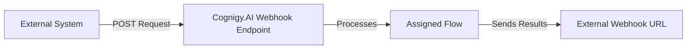

# Webhook

<figure>
  
</figure>

{! _includes/release-notes/handover-providers-deprecation.md !}

The Webhook Endpoint connects your AI Agent to external systems by sending real-time events, such as user or system messages, to a specified callback (webhook) URL. 

The Endpoint receives `POST` requests at the Cognigy.AI Endpoint URL, processes them with the assigned Flow, and sends results asynchronously to your webhook URL.



If you use [Agent Copilot for voice](../../../ai-copilot/voice/voice-overview.md) with the Webhook Endpoint, you can switch to a specific [Voice Copilot](voice-copilot.md) Endpoint. This Endpoint includes all webhook logic, so you don't need to use a Code Node.

## Prerequisites

- Run a web server on your side to receive `POST` requests from Cognigy.AI at your webhook URL.
- _(Optional)_ Set up basic authentication for your web server.

## Generic Endpoint Settings

Learn about the generic Endpoint settings on the following pages:

- [Endpoints Overview](../endpoints/overview.md)
- [NLU Connectors](../../empower/nlu/external/nlu-connector-reference/all-nlu-connectors.md)
- [Data Protection & Analytics](../endpoints/data-protection-and-analytics.md)
- [Real-Time Translation Settings](../endpoints/real-time-translation-settings.md)
- [Handover Settings](../endpoints/handover-settings.md)
- [Inject and Notify](../endpoints/inject-and-notify.md)

## How to Set Up

### Setup on the Cognigy.AI Side

??? info "1. Create a Webhook Endpoint"
    1. In the left-side menu of your Project, click **Deploy > Endpoints**.
    2. On the **Endpoints** page, click **+ New Endpoint**.
    3. In the **New Endpoint** section, do the following:
        1. Select the **Webhook** Endpoint type.
        2. Specify a unique name.
        3. Select a Flow from the list.
    4. Go to the **Basic Auth Credentials** section and enter the external webhook URL in the **Webhook** field. This URL is where Cognigy.AI will send output data.
    5. _(Optional)_ If your webhook uses basic authentication, fill in the **User** and **Password** fields.
    6. Save changes and go to the **Configuration Information** section. For sending `POST` requests to the Cognigy.AI Webhook Endpoint, copy the URL from the **Endpoint URL** field.

### Setup on the Third-Party Provider Side

??? info "1. Send a Request"

    Send a `POST` request to the Cognigy.AI Webhook Endpoint. Your web server should accept `POST` requests and process the JSON payload sent by Cognigy.AI. For testing purposes, you can use [webhook.site](https://webhook.site) as a temporary web server.

    === "cURL"
        Replace `https://<your-endpoint-url>` with the Endpoint URL from your Endpoint's settings.
    
        ```bash
        curl -X POST https://<your-endpoint-url> \
          -H "Content-Type: application/json" \
          -d '{
            "userId": "user123",
            "sessionId": "session123",
            "text": "Hello, I need help with my order",
            "data": {
              "exampleKey": "exampleValue"
            }
          }'
        ```
    
    === "Postman"
        1. Open the Postman collection, select **Add a request**, then set the request type to `POST`.
        2. Enter the Endpoint URL as the request URL. 
        3. Go to the **Headers** tab and add `Content-Type: application/json`. 
        4. Go to the **Body** tab, select **raw**, then select **JSON** as the format.
        5. Paste the request body:
    
        ```json
        {
          "userId": "user123",
          "sessionId": "session123",
          "text": "Hello, I need help with my order",
          "data": {
            "exampleKey": "exampleValue"
          }
        }
        ```

    | Parameter | Type   | Description                                                                                                                                                                                                 | Required                        |
    |-----------|--------|-------------------------------------------------------------------------------------------------------------------------------------------------------------------------------------------------------------|---------------------------------|
    | userId    | String | The ID of the end user.                                                                                                                                                                                     | Yes                             |
    | sessionId | String | The ID used to track the current session and maintain its state. Generate a new unique ID for each new session. For testing, you can use any string and change it whenever you want to start a new session. | Yes                             |
    | text      | String | The text that the assigned Flow should process.                                                                                                                                                             | No,  if `data` is specified[^*] |
    | data      | Object | The data that the assigned Flow should process.                                                                                                                                                             | No,  if `text` is specified[^*] |

    [^*]: You must provide at least one of `text` or `data`. You can send either, or both. If both are missing or invalid, the REST Endpoint throws an error.

??? info "2. Get a Response"

    The following JSON response is sent by the Cognigy.AI Webhook Endpoint to your external system. This response contains information about the user, session, and the AI Agent output:

      ```JSON
      {
         "userId": "user123",
         "sessionId": "session123",
         "AIOutput": {
            "text": "I’d be happy to help. Could you please provide your order number?",
            "data": {},
            "traceId": "endpoint-httpIncomingMessage-83b52cb7-1452-4c2d-a57d-4a81e6adb92c",
            "disableSensitiveLogging": false,
            "source": "bot"
         }
      }
      ```

    | Parameter                 | Type    | Description                                                                                                                             |
    |---------------------------|---------|-----------------------------------------------------------------------------------------------------------------------------------------|
    | `userId`                  | String  | The ID of the user who sent the original request.                                                                                       |
    | `sessionId`               | String  | The session ID used to track the conversation context.                                                                                  |
    | `AIOutput.text`           | String  | The response message generated by the AI Agent.                                                                                         |
    | `AIOutput.data`           | Object  | The message data returned from the Flow.                                                                                                |
    | `AIOutput.traceId`        | String  | The ID used for tracing and debugging purposes.                                                                                         |
    | `AIOutput.source`         | String  | The message source. Always `"bot"` for AI Agent replies.                                                                                |
    | `disableSensitiveLogging` | Boolean | The flag indicating if logging is disabled. If the value is `true`, this interaction won't be logged for privacy or compliance reasons. |