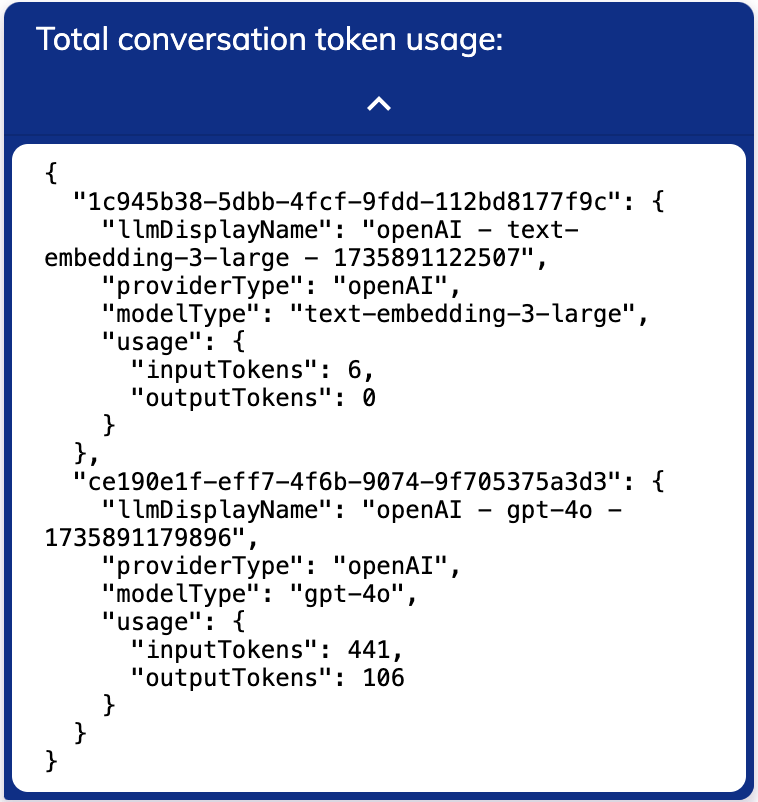

# Large Language Model Token Counter

[](../../../release-notes/4.92.md)

In Cognigy.AI, you can use a [Code Node](../../build/node-reference/basic/code/overview.md) to track the Large Language Model (LLM) token usage. This way, you can track your [LLM providers](providers/all-providers.md) costs.

## Prerequisite

- You have configured LLMs that [support Knowledge Search and Answer Extraction](model-support-by-feature.md).
- You have added a Node that uses an LLM to your Flow, for example, an [LLM Prompt Node](../../build/node-reference/service/llm-prompt.md), a [Search Extract Output Node](../../build/node-reference/other-nodes/knowledge-search.md), an [AI Agent Node](../../build/node-reference/ai/ai-agent.md), or [AI Copilot Nodes](../../build/node-reference/ai-copilot/overview.md).

## Limitations

- The LLM Token Counter supports only [OpenAI](providers/openai.md) and [Azure OpenAI](providers/microsoft-azure-openai.md) embedding models. If you configure an Aleph Alpha embedding model, you receive 0 as the total token count.

## Set Up an LLM Token Counter

1. Add a Code Node after the Node that uses an LLM, for example, after an [AI Agent Node](../../build/node-reference/ai/ai-agent.md).
2. Add the following code to the Code Node:

    ```javaScript
    // fetches the token usage
    const tokens = api.getLLMTokenUsageForSession();

    // outputs the token usage
    api.say("Total conversation token usage: ", tokens);

    ```

    `"Total conversation token usage: "` corresponds to the message text the LLM Token Counter sends to indicate the token usage. You can change the message text as needed. `tokens` corresponds to the token usage values. The LLM Token Counter sends the token usage in JSON format after the message text.

## LLM Token Counter Output

After your Node triggers the LLM, the Code Node provides the following message with the token usage for each model used in your Flow:

<figure>
    
</figure>

The LLM Token Counter displays the total input and output tokens within the chat sessions in the `inputTokens` and `outputTokens` JSON parameters.

!!!note "Embedding Models Output Tokens"
    The output tokens count for the Knowledge Search model is always 0. 

## More Information

- [Overview](overview.md)
- [LLM Providers](providers/all-providers.md)
- [Model Support by Feature](model-support-by-feature.md)
