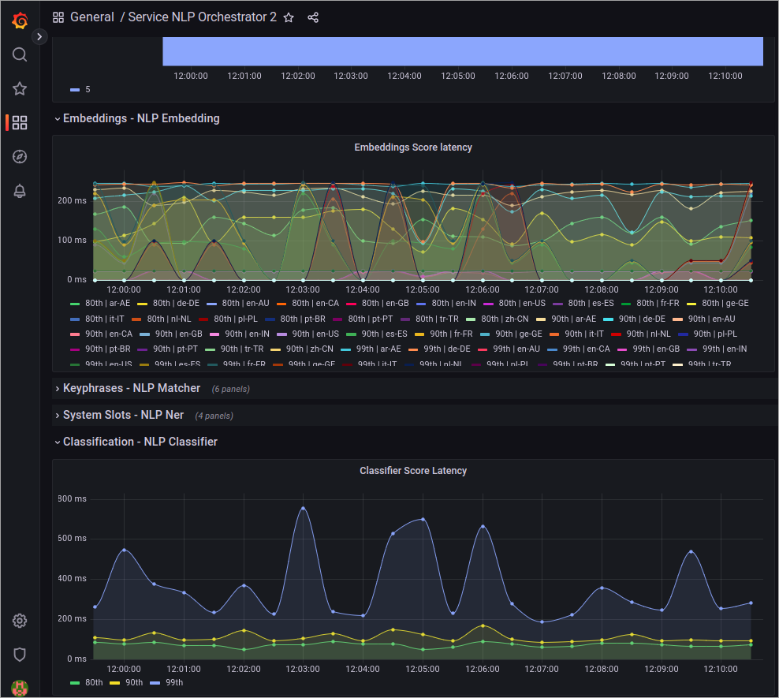
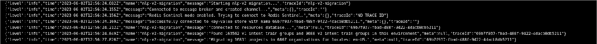
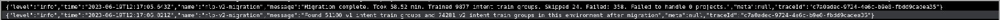
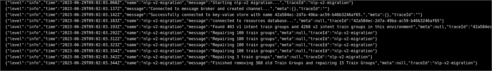
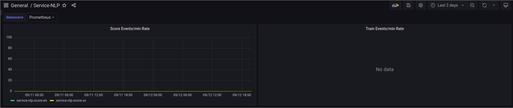

# Cognigy NLU: from V1 to V2

[](../../../release-notes/4.60.md)

This guide is intended for Cognigy on-premises customers who are migrating from the older version of Cognigy NLP to the newer version.

!!! note "Deprecation of Cognigy NLU V1"
    Starting from release **4.60.0**, we will only provide bug fixes for the old NLP services if they are critical. The old NLP services will be fully deprecated with release **4.64.0**, at which point all on-premises customers should have migrated. After the **4.64.0** release, the old NLP services will no longer be available.

## Introduction

We have improved our NLP services' scalability, reliability, and security to handle large workloads and reduce hardware footprint. In doing so, we have split our existing NLP architecture into multiple smaller services that scale better independently. In addition, we have adjusted how we store the trained NLU models, leading to less memory required by the services when training the models. Due to this change, it is therefore required to rebuild the models on the system. Since manually rebuilding the models would take significant effort, we have written a migration job that takes care of it. This guide describes how to use the migration job.

We have successfully migrated and removed the old NLP services on all customer production environments hosted by Cognigy.

## Terminology

This guide uses specific terms.

_**Old NLP services**_

Refers to the deprecated NLP services.

_**NLP V2 stack**_

Refers to the new NLP services that we have introduced.

## What's New?

### Changes to Functionality

These changes have **no impact** on the functionality of existing AI Agents. All intent models will continue to work as they do now, as we have not implemented any functional changes.

To ensure this is the case, we have monitored thousands of requests and compared the intent results between the old and the new NLP services. Our findings showed that in less than 1% of requests, there was a change in the intent scores. In those few cases, the changes in intent scores were minimal.

### Changes to Service Architecture

The following services will be deprecated:

- `service-nlp-score-<language>`
- `service-nlp-train-<language>`

Instead, the following services will be introduced:

- `service-nlp-orchestrator`
- `service-nlp-classifier-score-<language>`
- `service-nlp-classifier-train-<language>`
- `service-nlp-embedding-<language>`

The new services are smaller than the old services and can better reuse components between scoring and training, as well as between different languages. The new architecture also allows for a much more flexible scaling when a load increases in an environment.

## Migration Quality Assurance

The Cognigy team began deploying the new NLP services with the release **4.54.0** of Cognigy.AI. As a result, we already have significant experience running these services in production and migrating existing AI Agents to use the new services.

Furthermore, we **successfully migrated all Cognigy-hosted customer environments without downtime or impacting the users**.

## Migrate Dev and Production Environments

If you have multiple environments running Cognigy.AI, such as development and production,
then it is important to **deploy NLP V2 on all environments at the same time**.
This ensures that Snapshots work smoothly when transferred between these environments.

## Prerequisites

Before beginning the migration, ensure the following prerequisites are met:

- Deploy Cognigy.AI version 4.54.0 or higher.
- Deploy the NLP V2 stack in all environments (see below).

### Install the NLP V2 Stack

#### Enable NLP V2

To enable the NLP V2 Stack, you need to set environment variables in the `cognigyEnv` config map and deploy some new services.

The environment variables that need to be set in the `cognigyEnv` config map are:

```yaml
cognigyEnv:
  FEATURE_USE_SERVICE_NLP_V2: "true"
  FEATURE_MIGRATE_SNAPSHOTS_TO_NLP_V2: "true"
```

Setting these environment variables will not affect existing models. However, as soon as you retrain your NLU model, it will be trained using the NLP v2 stack.

#### Add NLP V2 Services

The new NLP V2 stack contains the following services:

- `service-nlp-orchestrator`
- `service-nlp-embedding-<language>`
- `service-nlp-classifier-score-<language>`
- `service-nlp-classifier-train-<language>`

You need to add these services to your `values-local.yaml` file according to this example:

```yaml
serviceNlpOrchestrator:
  enabled: true
  replicaCount: 3

serviceNlpEmbeddingEn:
  enabled: true
  replicaCount: 3

serviceNlpEmbeddingXx:
  enabled: true
  replicaCount: 3

serviceNlpEmbeddingGe:
  enabled: true
  replicaCount: 2

serviceNlpClassifierScoreEn:
  enabled: true
  replicaCount: 3

serviceNlpClassifierTrainEn:
  enabled: true
  replicaCount: 3
  
serviceNlpClassifierScoreDe:
  enabled: true
  replicaCount: 3

serviceNlpClassifierTrainDe:
  enabled: true
  replicaCount: 3

serviceNlpClassifierScoreXx:
  enabled: true
  replicaCount: 3

serviceNlpClassifierTrainXx:
  enabled: true
  replicaCount: 3

serviceNlpClassifierScoreGe:
  enabled: true
  replicaCount: 3

serviceNlpClassifierTrainGe:
  enabled: true
  replicaCount: 3

serviceNlpClassifierScoreJa:
  enabled: true
  replicaCount: 3

serviceNlpClassifierTrainJa:
  enabled: true
  replicaCount: 3

serviceNlpClassifierScoreKo:
  enabled: true
  replicaCount: 3

serviceNlpClassifierTrainKo:
  enabled: true
  replicaCount: 3
```

**Make sure to apply these changes to all of your Cognigy.AI environments.**

#### Choose which Languages to Deploy

Similar to the NLP V1 stack, deploy the services for the languages that you need. The table below shows you which services you need for which languages. Note that `service-nlp-orchestrator` is always needed.

| Language                 | Code  | service-nlp-embedding instance | service-nlp-classifier instance                                    |
|--------------------------|-------|--------------------------------|--------------------------------------------------------------------|
| Universal                | ge-GE | service-nlp-embedding-ge       | service-nlp-classifier-score-ge & service-nlp-classifier-train-ge  |
| Finnish - Finland        | fi-FI | service-nlp-embedding-ge       | service-nlp-classifier-score-ge & service-nlp-classifier-train-ge  |
| Swedish - Sweden         | sv-SE | service-nlp-embedding-ge       | service-nlp-classifier-score-ge & service-nlp-classifier-train-ge  |
| Danish - Denmark         | da-DK | service-nlp-embedding-ge       | service-nlp-classifier-score-ge & service-nlp-classifier-train-ge  |
| Norwegian - Norway       | nn-NO | service-nlp-embedding-ge       | service-nlp-classifier-score-ge & service-nlp-classifier-train-ge  |
| Vietnamese - Vietnam     | vi-VN | service-nlp-embedding-ge       | service-nlp-classifier-score-ge & service-nlp-classifier-train-ge  |
| Hindi - India            | hi-IN | service-nlp-embedding-ge       | service-nlp-classifier-score-ge & service-nlp-classifier-train-ge  |
| Bangla - Bangladesh      | bn-IN | service-nlp-embedding-ge       | service-nlp-classifier-score-ge & service-nlp-classifier-train-ge  |
| Tamil - India            | ta-IN | service-nlp-embedding-ge       | service-nlp-classifier-score-ge & service-nlp-classifier-train-ge  |
| German - Germany         | de-DE | service-nlp-embedding-xx       | service-nlp-classifier-score-de && service-nlp-classifier-train-de |
| Japanese - Japan         | ja-JP | service-nlp-embedding-xx       | service-nlp-classifier-score-ja & service-nlp-classifier-train-ja  |
| Korean - Korea           | ko-KR | service-nlp-embedding-xx       | service-nlp-classifier-score-ko & service-nlp-classifier-train-ko  |
| Arabic - U.A.E.          | ar-AE | service-nlp-embedding-xx       | service-nlp-classifier-score-xx & service-nlp-classifier-train-xx  |
| Spanish - Spain          | es-ES | service-nlp-embedding-xx       | service-nlp-classifier-score-xx & service-nlp-classifier-train-xx  |
| French - France          | fr-FR | service-nlp-embedding-xx       | service-nlp-classifier-score-xx & service-nlp-classifier-train-xx  |
| Dutch - Netherlands      | nl-NL | service-nlp-embedding-xx       | service-nlp-classifier-score-xx & service-nlp-classifier-train-xx  |
| Italian - Italy          | it-IT | service-nlp-embedding-xx       | service-nlp-classifier-score-xx & service-nlp-classifier-train-xx  |
| Polish - Poland          | pl-PL | service-nlp-embedding-xx       | service-nlp-classifier-score-xx & service-nlp-classifier-train-xx  |
| Portuguese - Portugal    | pt-PT | service-nlp-embedding-xx       | service-nlp-classifier-score-xx & service-nlp-classifier-train-xx  |
| Portuguese - Brazil      | pt-BR | service-nlp-embedding-xx       | service-nlp-classifier-score-xx & service-nlp-classifier-train-xx  |
| Thai - Thailand          | th-TH | service-nlp-embedding-xx       | service-nlp-classifier-score-xx & service-nlp-classifier-train-xx  |
| Russian - Russia         | ru-RU | service-nlp-embedding-xx       | service-nlp-classifier-score-xx & service-nlp-classifier-train-xx  |
| Turkish - Turkey         | tr-TR | service-nlp-embedding-xx       | service-nlp-classifier-score-xx & service-nlp-classifier-train-xx  |
| Chinese - China          | zh-CN | service-nlp-embedding-xx       | service-nlp-classifier-score-xx & service-nlp-classifier-train-xx  |
| English - United States  | en-US | service-nlp-embedding-en       | service-nlp-classifier-score-en & service-nlp-classifier-train-en  |
| English - India          | en-IN | service-nlp-embedding-en       | service-nlp-classifier-score-en & service-nlp-classifier-train-en  |
| English - United Kingdom | en-GB | service-nlp-embedding-en       | service-nlp-classifier-score-en & service-nlp-classifier-train-en  |
| English - Canada         | en-CA | service-nlp-embedding-en       | service-nlp-classifier-score-en & service-nlp-classifier-train-en  |
| English - Australia      | en-AU | service-nlp-embedding-en       | service-nlp-classifier-score-en & service-nlp-classifier-train-en  |

#### Scale down Old Train Services

When the NLP V2 stack is running, all new intent training jobs will use the NLP V2 stack. You can therefore already scale down the **service-nlp-train-<language>** services. You can do this by setting `enabled: false` in the values-local.yaml.

Example:

```yaml
serviceNlpTrainEn:
  enabled: false
```

#### Increase Memory Limit

Similar to the NLP V1 stack, you might run into issues with the default memory limit of the nlp-classifier-train service when training large models, though we have greatly improved the amount of memory necessary. We recommend beginning with the default resource constraints and then increasing the classifier-train service's memory limit as needed.

The orchestrator and embedding services do not require additional memory for training large Flows.

#### Scale the NLP V2 Stack

As more projects begin to use the NLP V2 stack, the need for scaling may arise. The simplest approach is to monitor the **NLP Orchestrator** dashboard in Grafana, where you can assess the overall system latency and determine whether scaling is required for components such as embeddings or the classifier.



It might also be necessary to scale up the nlp-orchestrator itself, although this is quite uncommon. On the same dashboard, you can monitor the CPU load of the service. If it approaches 1 CPU, then it's advisable to scale this service accordingly.

#### Validate that the Services are Deployed Correctly

To validate that the services have been deployed correctly, you can build the NLU model of a Flow. Then, open the logs of the `service-nlp-classifier-train-<language>` service and ensure that the service is logging that it is training the model.

## Run the Migration

The migration is run by applying a `Kubernetes Job` into the cluster. This job will run for some time and migrate all existing NLU Models to the NLP V2 Stack. Before running the migration script, ensure the NLP V2 stack is properly running as per the last chapter.

The standard migration job will migrate all models across all organizations and languages, including models in Snapshots. It will migrate three projects simultaneously, with one Flow per project.

```yaml
apiVersion: batch/v1
kind: Job
metadata:
  name: migrate-nlp-v2-all-organisations
spec:
  ttlSecondsAfterFinished: 100
  template:
    spec:
      restartPolicy: Never
      volumes:
        - name: rabbitmq-connection-string
          secret:
            secretName: cognigy-rabbitmq
            items:
              - key: connection-string
                path: rabbitmqConnectionString
        - name: mongodb-connection-string
          secret:
            secretName: cognigy-service-resources
            items:
              - key: connection-string
                path: mongodbConnectionString
        - name: redis-password
          secret:
            secretName: cognigy-redis-password
      imagePullSecrets:
        - name: cognigy-registry-token
      containers:
        - name: nlp-v2-migrator-all
          image: cognigy.azurecr.io/nlp_v2_migrator:6f28f4760e24678a27b5649555b7e0fdcdea0ebb
          volumeMounts:
            - name: rabbitmq-connection-string
              mountPath: /var/run/secrets/rabbitmqConnectionString
              subPath: rabbitmqConnectionString
            - name: mongodb-connection-string
              mountPath: /var/run/secrets/mongodbConnectionString
              subPath: mongodbConnectionString
            - name: redis-password
              mountPath: /var/run/secrets/redis-password.conf
              subPath: redis-password.conf
          envFrom:
            - configMapRef:
                name: cognigy-env
          env:
            - name: SERVICE_RESOURCES_CONNECTION_STRING
              valueFrom:
                secretKeyRef:
                  name: cognigy-service-resources
                  key: connection-string

          args:
            - -o
            - "all"
            - -c
            - "2"
            - -cf
            - "2"
            - -s
            - "true"
```

### Which Environment to Migrate First?

In case you have multiple environments, such as development and production, then the development environment should be migrated first.

### Tweak the Migration Parameters

If the standard configuration doesn't align with your preferred way of migrating the models, we offer various configuration options to tailor the process to your needs. For example, you can select specific projects or speed up the migration.

To do this, use the following parameters:

| Value | Description                                                                                                                                                          | Examples                                            |
|-------|----------------------------------------------------------------------------------------------------------------------------------------------------------------------|-----------------------------------------------------|
| -o    | The organizations to run for. A comma-separated list of `organisationID` values                                                                                      | "63c6af010aa7a0eadd88edbd,63c6af010aa7a0eadd88edbe" |
| -p    | The projects to migrate. A comma-separated list of project IDs                                                                                                       | "63c6af010aa7a0eadd88edbd,63c6af010aa7a0eadd88edbe" |
| -l    | The locales to run for. A comma-separated list of language codes                                                                                                     | "en-US,de-DE,ar-AE"                                 |
| -c    | The amount of projects to migrate in parallel                                                                                                                        | "10"                                                |
| -cf   | The amount of Flows per project to migrate in parallel                                                                                                               | "10"                                                |
| -s    | Whether to migrate models in Snapshots                                                                                                                               | "true"                                              |
| -ct   | Count the number of models per locale. This process doesn't involve migration but provides you with a list of how many models exist per locale, offering an overview | "true"                                              |

### Increase the Speed of the Migration

The migration process can take a considerable amount of time, depending on the number of Flows present in the environment. If you have the option to add extra hardware for the migration or if you have additional capacity available, it's possible to scale up the NLP V2 stack and migrate multiple projects simultaneously. To achieve this, we recommend migrating language by language. For instance, start by migrating all English models, followed by all models that use the `XX` container group, and so on.

To scale up the services, use the following guidelines:

- If you want to migrate 20 models at once, increase the capacity of the `nlp-classifier-train-<language>` service to handle 20 training jobs simultaneously.
- If you have 20 classifiers, increase the number of replicas for the `service-nlp-embedding-<language>` service to 8, which corresponds to 40% of the total number of classifiers you possess.
- If you have 20 classifiers, increase the number of replicas for the `service-nlp-ner` service to 16, which corresponds to 80% of the total number of classifiers you possess.
- If you have 20 classifiers, increase the number of replicas for the `service-nlp-orchestrator` service to 4, which corresponds to 20% of the total number of replicas of `service-nlp-classifier`.

After scaling up, you can modify the `-c` and `-cf` parameters to achieve the number of models to train in parallel. If you have many projects, we recommend using a higher value for `-c`. Conversely, if you have a few projects with a lot of Flows, it is advisable to set a higher value for `-cf`.

Here is an example of training 20 Flows in parallel for the `XX` train group:

```yaml
apiVersion: batch/v1
kind: Job
metadata:
  name: migrate-nlp-v2-all-organisations
spec:
  ttlSecondsAfterFinished: 100
  template:
    spec:
      restartPolicy: Never
      volumes:
        - name: rabbitmq-connection-string
          secret:
            secretName: cognigy-rabbitmq
            items:
              - key: connection-string
                path: rabbitmqConnectionString
        - name: mongodb-connection-string
          secret:
            secretName: cognigy-service-resources
            items:
              - key: connection-string
                path: mongodbConnectionString
        - name: redis-password
          secret:
            secretName: cognigy-redis-password
      imagePullSecrets:
        - name: cognigy-registry-token
      containers:
        - name: nlp-v2-migrator-all
          image: cognigy.azurecr.io/nlp_v2_migrator:6f28f4760e24678a27b5649555b7e0fdcdea0ebb
          volumeMounts:
            - name: rabbitmq-connection-string
              mountPath: /var/run/secrets/rabbitmqConnectionString
              subPath: rabbitmqConnectionString
            - name: mongodb-connection-string
              mountPath: /var/run/secrets/mongodbConnectionString
              subPath: mongodbConnectionString
            - name: redis-password
              mountPath: /var/run/secrets/redis-password.conf
              subPath: redis-password.conf
          envFrom:
            - configMapRef:
                name: cognigy-env
          env:
            - name: SERVICE_RESOURCES_CONNECTION_STRING
              valueFrom:
                secretKeyRef:
                  name: cognigy-service-resources
                  key: connection-string

          args:
            - -o
            - "all"
            - -l
            - "ar-AE,es-ES,fr-FR,nl-NL,it-IT,pl-PL,pt-PT,pt-BR,th-TH,ru-RU,tr-TR,zh-CN"
            - -c
            - "5"
            - -cf
            - "4"
            - -s
            - "true"
```

### Run the Job

To run the job, use the `kubectl apply` command to apply it into the namespace:

```bash
kubectl apply -n <namespace-of-cognigy-ai> <path-to-job>
```

When running the job, you should initially see a printout indicating the number of V1 train groups and the number of projects existing in the system:



When the migration job has finished running, you should check how many models have been successfully migrated and whether any have failed. If any models have failed, you should run the script again. If you notice that any of the classifier-train Pods experienced restarts, you might need to increase their memory before proceeding:



#### Re-run the Job

If the job fails or if you need to run it again, it is always safe to do so. The job is aware of which models still need to be migrated and will continue where it left off.

### Clean up Old Data

After completing the migration of all models, you might encounter a situation where the migration script still indicates that there are V1 models pending training. This situation can occur due to old data not thoroughly cleaned up, for example, during the deletion of Snapshots.

To resolve this issue, run the job again with the `-r` flag, which will repair the data. **Only run this after you have completed all other migration tasks.**

```yaml
apiVersion: batch/v1
kind: Job
metadata:
  name: migrate-nlp-v2-all-organisations
spec:
  ttlSecondsAfterFinished: 100
  template:
    spec:
      restartPolicy: Never
      volumes:
        - name: rabbitmq-connection-string
          secret:
            secretName: cognigy-rabbitmq
            items:
              - key: connection-string
                path: rabbitmqConnectionString
        - name: mongodb-connection-string
          secret:
            secretName: cognigy-service-resources
            items:
              - key: connection-string
                path: mongodbConnectionString
        - name: redis-password
          secret:
            secretName: cognigy-redis-password
      imagePullSecrets:
        - name: cognigy-registry-token
      containers:
        - name: nlp-v2-migrator-all
          image: cognigy.azurecr.io/nlp_v2_migrator:6f28f4760e24678a27b5649555b7e0fdcdea0ebb
          volumeMounts:
            - name: rabbitmq-connection-string
              mountPath: /var/run/secrets/rabbitmqConnectionString
              subPath: rabbitmqConnectionString
            - name: mongodb-connection-string
              mountPath: /var/run/secrets/mongodbConnectionString
              subPath: mongodbConnectionString
            - name: redis-password
              mountPath: /var/run/secrets/redis-password.conf
              subPath: redis-password.conf
          envFrom:
            - configMapRef:
                name: cognigy-env
          env:
            - name: SERVICE_RESOURCES_CONNECTION_STRING
              valueFrom:
                secretKeyRef:
                  name: cognigy-service-resources
                  key: connection-string

          args:
            - -o
            - "all"
            - -s
            - "true"
            - -r
            - "true"
```

After running it, you will see how many old models could be safely removed and how many were repaired.
If any models were repaired, then you need to **run the migration again**:



## Check if Migration is Complete

To ensure that the migration has been completed successfully and that NLP V1 is no longer in use, check the **Service NLP** dashboard in Grafana. Here, you can monitor the traffic received by the old NLP V1 stack. We recommend observing this for a couple of days, and if it consistently shows 0 loads, you can safely remove the V1 stack.



### Remove the NLP V1 Stack

To remove the NLP V1 stack, remove the `service-nlp-score-<lang>` and `service-nlp-train-<lang>` services from your `values-local.yaml` file.

## FAQ

**Q1:** Is it required to make any changes to existing projects after migrating?

**A1:** No, the migration has no impact on existing projects.

**Q2:** Will a project work properly if only some of the Flows have been migrated to NLP V2?

**A2:** Yes, a project will work fine if some Flows are using NLP V2, while others are using NLP V1.  This is applicable as long as the **score** containers of NLP V1 are still operational in the environment.

**Q3:** Will a project work properly if some locales have been migrated to NLP V2 and others not?

**A3:** Yes, a project will work fine if some locales have been migrated to NLP V2 while others have not.

**Q4:** What happens if I upload an old Snapshot created before NLP V2 existed?

**A4:** When you upload a Snapshot, all the NLU models of the Snapshot will be migrated to NLP V2 as part of the upload, if necessary. An overview of the models that were migrated can be seen in the Task Menu.
 