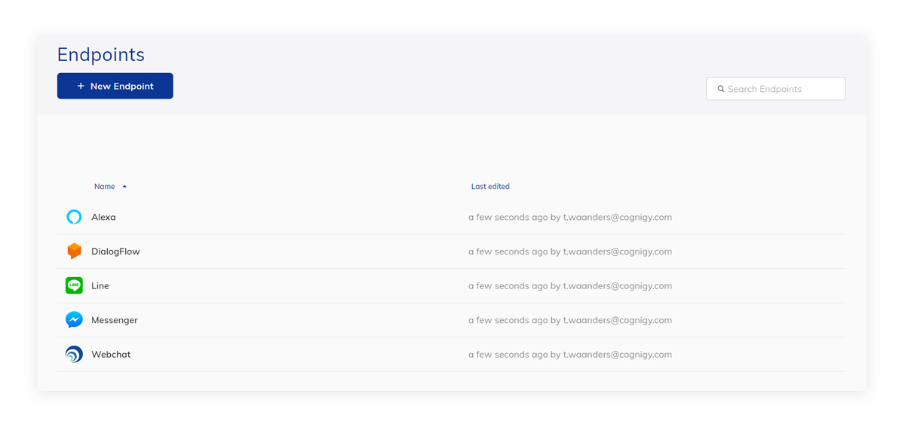
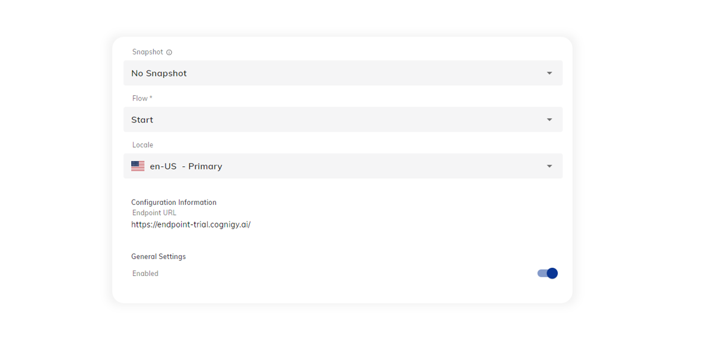

# Overview

Endpoints are the connector between your user interface and the Cognigy Agent. This connection can range from text based conversation to a conversation on your contact center phone-lines.

 <figure>
  
</figure>

## Features

Every Endpoint has the following features: 
- it points to a single Locale of a single Flow of a single Snapshot
- it can be disabled
- customization of the [Data Protection & Analytics](data-protection-and-analytics.md) 
- it can have its own [Transformer Function](transformers/transformers.md) 

 <figure>
  
</figure>

Selected Endpoints also have the option to customize the NLU that provides the Intent and Slot mapping for the agent. 

 <figure>
  
</figure>

The [NLU Connectors](../resources/build/nlu-connectors.md) that are configured to the agent are available to select from this dropdown menu. Alternatively, the [No NLU]({{config.site_url}}ai/nlu/external-nlu/no-nlu/) option can be selected to completely disable the intent and slot mapping for an endpoint. 

Additionally, there are Endpoint specific features and configuration options available.

## Cognigy Endpoints

The following Endpoints are specific to the Cognigy.AI platform:

- [Cognigy Webchat](webchat/webchat.md) 
- [Cognigy Voice Gateway](cognigy-vg.md) 

## Generic Endpoints

The following Endpoints are provided for custom integrations:

- [REST](rest.md) 
- [Socket](socketio.md) 
- [Webhook](webhook.md) 

## Third Party Endpoints

The following Endpoints provide integrations with third party products:

- [Amazon Alexa](amazon-alexa.md)
- [Amazon Lex (Beta)](amazon-lex.md) 
- [Avaya CPaaS](avaya-cpaas.md) 
- [Dialogflow](dialogflow.md) 
- [Facebook Messenger](facebook-messenger.md) 
- [Intercom](intercom.md) 
- [LINE Messenger](line-messenger.md) 
- [Azure Bot Services](azure-bot-services.md) 
- [Microsoft Teams](microsoft-teams.md) 
- [RingCentral Engage](ringcentral-engage.md)
- [Slack](slack.md) 
- [Sunshine Conversations](sunshine-conversations.md) 
- [Twilio](twilio.md) 
- [Userlike](userlike.md) 
- [Workplace by Facebook](workplace-by-fb.md)
- [WhatsApp](whatsapp.md)
- [8x8](8x8.md)