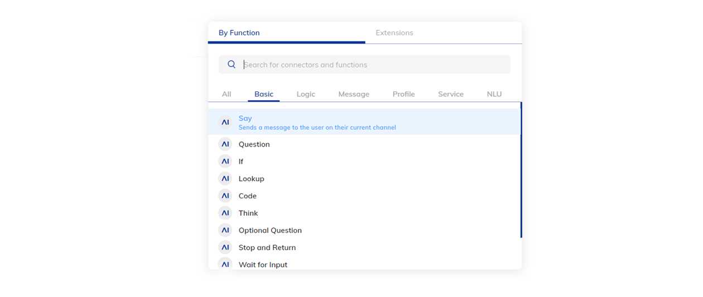
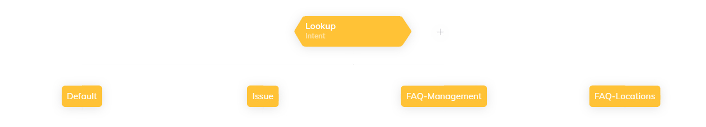

# Flow Nodes Overview

Flow Nodes can be used to add interactivity to a Flow. When combined in a certain way, they can help create dynamic interactive conversations. There are many types of Nodes, ranging from Basic to Advanced. 
{ width=100% }

| Node Categories      |
| ----------- |
| [Basic Nodes]({{config.site_url}}ai/flow-nodes/flow-nodes-overview/#basic-nodes)      |
| [Message Nodes]({{config.site_url}}ai/flow-nodes/flow-nodes-overview/#message-nodes)       |
| [Logic Nodes]({{config.site_url}}ai/flow-nodes/flow-nodes-overview/#logic-nodes)    |
| [Profile Nodes]({{config.site_url}}ai/flow-nodes/flow-nodes-overview/#profile-nodes)      |
| [Service Nodes]({{config.site_url}}ai/flow-nodes/flow-nodes-overview/#service-nodes)       |
| [NLU Nodes]({{config.site_url}}ai/flow-nodes/flow-nodes-overview/#nlu-nodes)   |

## Basic Nodes

**Basic Nodes** are Nodes that are commonly used in[ basic conversational Flows. Included are typical Nodes like the [**Say Node**]({{config.site_url}}ai/flow-nodes/flow-nodes-overview/#say), the [**Question Node**]({{config.site_url}}ai/flow-nodes/flow-nodes-overview/#question) as well as well as certain Flow actions like [**Stop and Return**]({{config.site_url}}ai/flow-nodes/flow-nodes-overview/#stop-and-return). 
## Message Nodes

Message Nodes generate certain output that is returned to the user. They are generally multi-channel capable, which means that they work across a broad-range of Endpoints.

### Say
This is the most basic output Node that can be used to send a message to the user on his current channel. 
{ width=100% }
### Question
The **Question Node** can be used to ask the user a question. When triggered, the Entry Point will shift to this Node so that the conversation can continue when the user answers - and a new [**Input**]({{config.site_url}}ai/tools/interaction-panel/input/) object is generated. By default, the [**Entry Point**]({{config.site_url}}ai/resources/build/flows/#entry-points) will stick to this Node until a valid answer has found.
{ width=100% }
### Optional Question
The **Optional Question Node** works similar to the **Question Node**, except for the fact that the Entry Point is optional by default. 
{ width=100% }
### Send Email
The Send Email Node can be used to send an email message directly from within the Flow. IT requires a [Connection]({{config.site_url}}ai/resources/build/connections/) in order to work.
{ width=100% }
### Datepicker
The Datepicker can be used to render a date selection widget in certain channels. It has an extensive list of configurable options.
{ width=100% }
## Logic Nodes

Logic Nodes can be used to execute a certain logic in the flow. They include classical conditions, as well as specific Flow behavior like waiting for a user input.
### If
The If Node is one of the most common Logic Nodes. It can be used to evaluate a statement and depending on the outcome, the Then or Else cases are triggered.  Conditions can be created using **CognigyScript **or using the built-in  [**Token System**]({{config.site_url}}ai/resources/manage/tokens/).
{ width=100% }
### Lookup
The Lookup Node acts as a switch between different options. A certain type of input (e.g. Intents) is evaluated and based on the value, a certain branch is executed.
{ width=100% }

???+ info "Coming from Cognigy version 3.x?"
    The **Lookup Node** was previously known as the **Switch Node**.
### Go To
The **Go To Node** can be used to jump between **Flows** or between **Nodes**. If the Go To Node is used to switch to another Flow, the **Entry Point** will switch to that Flow altogether (until switched back). 
{ width=100% }
### Execute Flow
The **Execute Flow** Node can be used to execute another Flow, meaning that it will run that Flow and return to the initial Flow afterwards. This means that the *Entry Point* will not switch to the new Flow. This operation can be compared to a function call. 
{ width=100% }
### Think
The **Think Node** can be used to deliberately inject a text into the **Start Node** of the Flow. This is useful in case it is necessary to start the Flow again, with a specific payload. The payload could, for example, correspond to a certain Intent.
{ width=100% }
### Once
Everything below a Once Node will be executed only once per session. This is useful in case the bot needs to greet the user or in case a database request needs to happen only once per session.
### Interval
The Interval Node can be used to only allow certain Nodes to be execute if a given time (interval) has passed. It is configurable with a number of milliseconds.
### Stop and Return
The Stop and Return node stops Flow execution and return to the Entry Point at the start node.
{ width=100% }
### Wait for Input
The Wait for Input Node waits for user input and continues Flow execution.
{ width=100% }
### Sleep
The Sleep Node pauses execution for an number of milliseconds. This Node used to be known as the Pause Node. 
{ width=100% }
### Set State
With the Set State Node, the Flow's [**State**]({{config.site_url}}ai/tools/interaction-panel/state/) can be changed.
{ width=100% }
### Reset State
With the Reset State Node, the Flow's [**State**]({{config.site_url}}ai/tools/interaction-panel/state/) can be reset.
{ width=100% }
## Profile Nodes

Profile Nodes are used to update  [**Contact Profile**]({{config.site_url}}ai/resources/manage/contact-profiles/)  information. Common operations are:
### Activate Profile
{ width=100% }
This Node can be used to active a  [**Contact Profile**]({{config.site_url}}ai/resources/manage/contact-profiles/)  in case it has been deactivated. The Node is not configurable. 
### Deactivate Profile
{ width=100% }
Can be used to deactivate the  [**Contact Profile**]({{config.site_url}}ai/resources/manage/contact-profiles/) .
### Update Profile
{ width=100% }
This Node is commonly used, as it helps update [**Contact Profile**]({{config.site_url}}ai/resources/manage/contact-profiles/) information. It is configurable with a drop-down of all the [**Contact Profile Schema**]({{config.site_url}}ai/resources/manage/contact-profiles/) attributes.  
### Merge Profile
{ width=100% }
This Node can be used to merge the current session to an existing  [**Contact Profile**]({{config.site_url}}ai/resources/manage/contact-profiles/) . The Node can be configured with an identifier that can be used as a user id.
### Blind Mode
{ width=100% }
The Blind Mode disables all (or selected) logging. The Node can be used whenever the Virtual Agent handles sensitive data, that should be excluded from the logs.

  * **Mask Loggin:** Outputs XXXX in the output logs of the Agent.
  * **Mask Analytics:** Outputs XXXX in the analytics (including Contact Profile conversations).
  * **Disable Conversations:** Disabled output analytics alltogether.

### Delete Profile
Deletes the currently active  [**Contact Profile**]({{config.site_url}}ai/resources/manage/contact-profiles/) .
### Complete Goal
Can be used to add a custom Goal to the  [**Contact Profile**]({{config.site_url}}ai/resources/manage/contact-profiles/). Custom Goals are KPIs that can be dynamically configured and that show up in the output analytics as well as the  [**Contact Profile**]({{config.site_url}}ai/resources/manage/contact-profiles/)  overview.
## Service Nodes

Service Nodes can be used to trigger external services, like databases and email servers. Cognigy.AI ships with a number of built-in services. Additional services can be added through [**Extensions**]({{config.site_url}}ai/resources/manage/extensions/) .
### HTTP Request
{ width=100% }
The **HTTP Request Node** is a very convenient Node that can execute **HTTP requests** to other interfaces (APIs). It can be configured with typical REST operations **(GET, POST, PATCH, PUT, DELETE)** and has configurable **JSON or Text payloads**.

Each request method has some field which it shares with the other methods. These are the fields:

  * **URL**
  * **Headers**
  * **Authorization Type**
  * **Context Store**
  * **Async**
  * **Caching**
    * **Cache Expiry**
#### URL
The URL to the targeted resource in the format: https://api-endpoint.com/resource
#### Headers
Here you can add the headers you need to successfully perform the HTTP request.
#### Authorization Type
  * **No Auth**
  * **Basic Auth**
  * **OAuth2**
  * **API Key - "Authorization: ApiKey"**
  * **API Key - "X-API-Key"**

In case you select a authorization type other than No Auth you'll get additional fields which depend on the selected authorization type.
#### Execution and Caching
This sections lets you configure the HTTP request to be asynchronous and optionally enable request caching.
### Send Email
The Send Email Node can be used to send an email message directly from within the Flow. IT requires a [Connection]({{config.site_url}}ai/resources/build/connections/) in order to work.
{ width=100% }
### MongoDB Nodes
Cognigy.AI has a built-in MongoDB connector that can be used directly within the Flow. The Node exposes a number of requests:
{ width=100% }
**Find**
Search for documents in a MongoDB Collection.

**Update Many**
Writes to a MongoDB Collection with many values at ones.

**Update One**
Write to a MongoDB Collection with a single value.

**Insert**
Inserts a document in a MongoDB Collection.

**MongoDB Aggregate**
Allows for an aggregation request in MongoDB.

**Remove**
Removes documents from a MongoDB Collection.

**Find One**
Search for a specific item in a MongoDB Collection
## Microsoft SQL Nodes
Cognigy.AI has a built-in Microsoft SQL connector that can be used directly within the Flow. The Node exposes a number of requests:
{ width=100% }
  * **Run SQL Query**
Executes an SQL Query.

  * **Run Transaction**
Runs a transaction.

  * **Run StoredProcedure**
Triggers a StoredProcedure.
## NLU Nodes

NLU Nodes are a collection of Nodes that are related to the platform's [**NLU**]({{config.site_url}}ai/nlu/overview/). It features a range of different Nodes.

### Question
{ width=100% }
The **Question Node** can be used to ask the user a question. When triggered, the Entry Point will shift to this Node so that the conversation can continue when the user answers - and a new [**Input**]({{config.site_url}}ai/tools/interaction-panel/input/) object is generated. By default, the [**Entry Point**]({{config.site_url}}ai/resources/build/flows/#entry-points) will stick to this Node until a valid answer has found. 
### Optional Question
{ width=100% }
The **Optional Question Node** works similar to the **Question Node**, except for the fact that the Entry Point is optional by default. 
### Copy Slots to Context
This Node can be used to copy slots that were detected and published in the [**Input**]({{config.site_url}}ai/tools/interaction-panel/input/)  object, to the conversation [**Context**]({{config.site_url}}ai/tools/interaction-panel/context/). 
### Add Lexicon Keyphrase
This Node can be used to dynamically create a [Lexicons]({{config.site_url}}ai/resources/build/lexicons/)  Keyphrase entry, either based on hardcoded or dynamic data.
### Execute Cognigy NLU
Can be used to explicitly execute **Cognigy's NLU** at a certain point in the flow. NLU execution happens automatically at the start of the Flow and with each new user input.
### Regex Slot Filler
This Node can be used to create a Slot based on a **Regex Pattern**. When the pattern is detected, a slot will be published to the [**Input**]({{config.site_url}}ai/tools/interaction-panel/input/)  object.