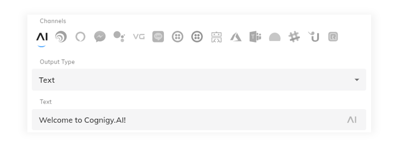
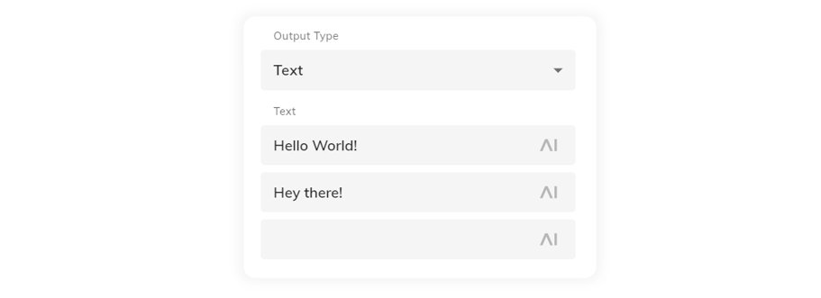
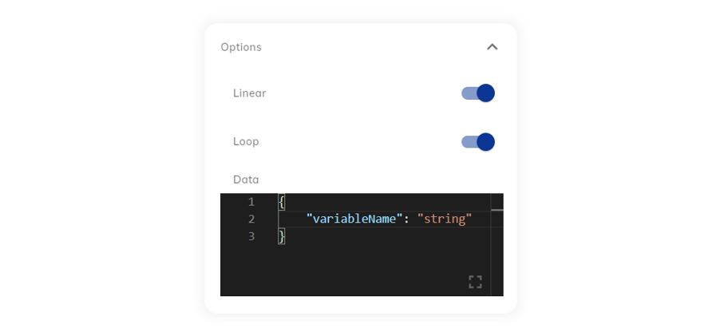
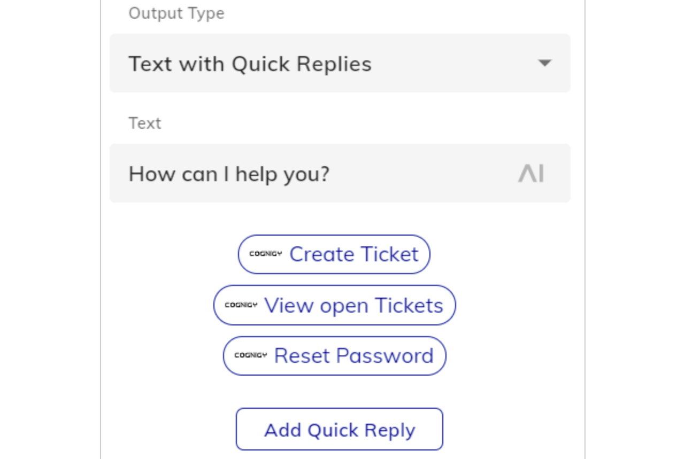
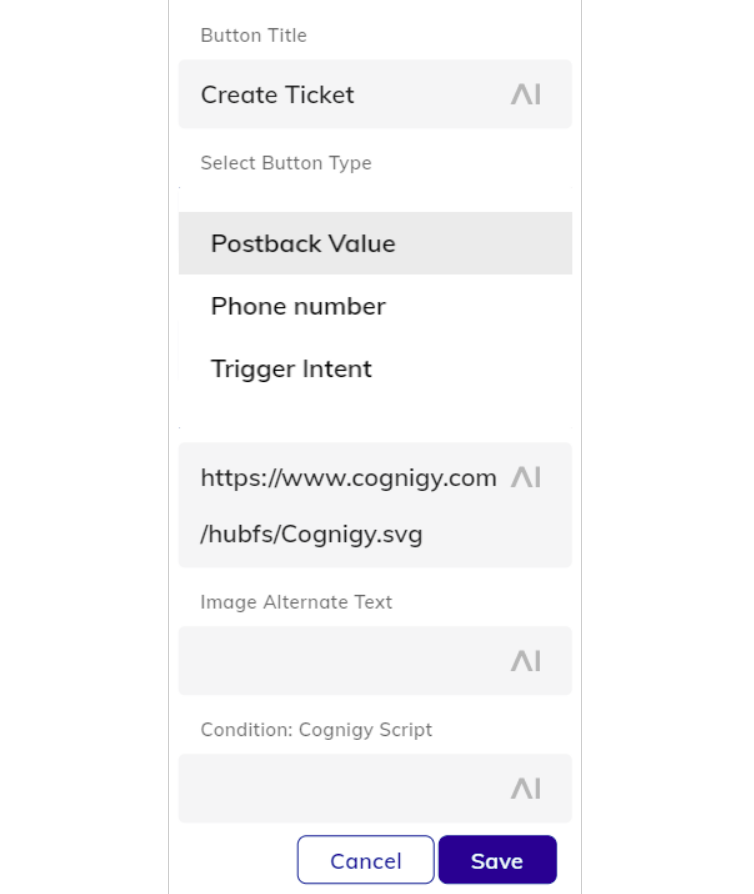

# Say
{ width=100% }
## Description

A Say Node is used to send a message to the user.

Depending on the current Channel, additional rich media formats are available. Add a new channel output by clicking the **"+"** icon and selecting the channel that corresponds to the channel endpoint that will be deployed.
{ width=100% }

<i>The say node menu with all channel output types enabled.</i>

If there is a Channel-specific configuration for the current Channel, this configuration will be used *instead* of the one on the default section.

## AI (default channel) 

{ width=100% }
???+ success "Automatic Conversion to Channel Specific Output"
    In case rich media is configured in the default AI tab, the platform will attempt to automatically convert the output to the channel's equivalent. Please check the specific Output Type above to verify channel support.
???+ warning "Fallback Text"
    In case the automatic conversion to channel specific output cannot take place, the Fallback Text will be triggered.

## Output Types

The AI Channel allows for the configuration of different **Output Types**:

### Text
{ width=100% }
The **Text** Output Type renders text and emojis (if supported by the channel). The text field also supports [CognigyScript]({{config.site_url}}/ai/tools/cognigy-script/) and [Tokens]({{config.site_url}}/ai/resources/manage/tokens/) that can be added by clicking the **AI** button at the end of each field.
???+ success "Channel Support"
    The **Text** Output Type is currently converted to compatible output on all channels. Please keep in mind that **emojis** may not render properly on all channels.
{ width=100% }
Multiple text messages can be added for conversational variation. When multiple text messages are configured, the delivery order is controlled by the *linear* and *loop* settings available in the ***options*** dropdown menu.
???+ warning "Using Multiple Text Outputs"
    By configuring multiple messages in a text say node, only one message will be delivered per activation of the node. An additional say node must be configured in order to send two text messages at once.
### Text Options
{ width=100% }
When sending simple text output, Cognigy.AI dialog nodes provide options for configuring the behavior of output and attaching data to the message. The configuration options and their functions are listed below:

| Parameter | Type | Description |
| ----------- | ----------- | ----------- |
| Linear | toggle | Iterates through the text options linearly instead of randomly. |
| Loop | toggle | If `linear` is set, the order restarts at the first text response after reaching the end. Otherwise the last text option will be repeatedly used, once reached. |
| Data | JSON | The data you want to send to the client |

???+ info "Linear and Loop"
    There are three different combinations of applying the Linear and Loop toggles, each providing a different behavior style for the order in which messages are delivered on future activation of the same node. The three combinations are:

    * Random (e.g. 4, 2, 5, 4, 4, 2, 5, 1, ...)
    * Linear + non-looping (e.g. 1, 2, 3, 4, 5, 5, 5, 5...)
    * Linear + looping (e.g. 1, 2, 3, 4, 5, 1, 2, 3, 4, 5...)
### Text with Quick Replies
{ width=100% }
Text with Quick Replies can be used to show the user a number of configurable Quick Replies. Quick Replies are pre-defined answers that are rendered as input chips.

{ width=100% }

The click action can be configured to be **Phone Number** or **Send Postback**.

{ width=100% }

