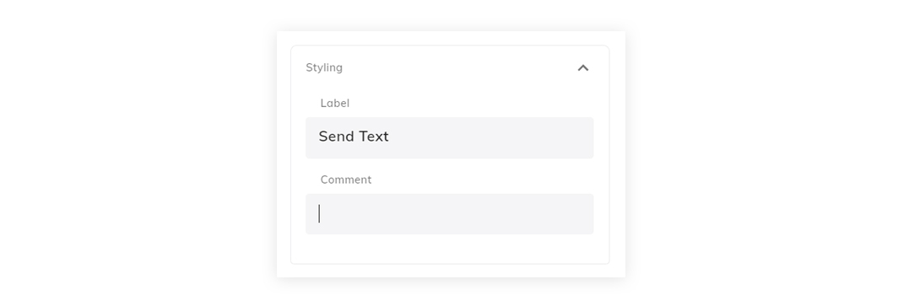
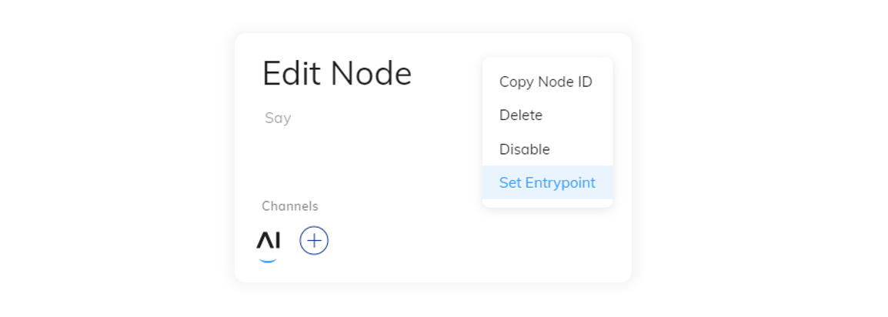

# General Node Usage
## Creating a Node

Flow Nodes can be used to add interactivity to a Flow. When combined in a certain way, they can help create dynamic interactive conversations. There are many types of Nodes, ranging from Basic to Advanced. 

Nodes can be created by clicking on the + icon in a [**Flow**]({{config.site_url}}ai/resources/build/flows/), after which the Node selection menu appears.
{ width=100% }
A Node can be copied by right-clicking it and pasted by right-clicking on a **+** section in the [**Flow**]({{config.site_url}}ai/resources/build/flows/). 
{ width=100% }
## Removing a Node

To remove a Node you can either delete or cut it. If you choose to cut the Node, you can paste it at the location of your choice (see "Paste a Node" below). If you delete it, it is gone but can be restored by reverting the change. Removing a Node also removes all of its child Nodes.
{ width=100% }
???+ info "Flow Editor Hotkeys"
    For a full list of flow editor keyboard shortcuts, see the [Hotkeys Page]({{config.site_url}}ai/tools/hotkeys/).
## Copy a Node

You can copy a Node with the corresponding menu option. This also copies all child Nodes (e.g. all the Case and Default Nodes and their children, if you copy a Lookup Node).
{ width=100% }
???+ info "Drag & Drop"
    The flow editor supports drag and drop within the flow editor. To copy a node, simply hold the **alt** key while dropping the node to the required location.
## Add Comment

You can add additional information about Nodes in the Node Comment. To add a comment, open a Node by clicking on on it and scroll down to the **Styling** section. Here you can add a comment.
{ width=100% }
## Add Label

Adding a Label replaces the bottom text line of a Node. This allows you to have a Node functionality summary that is directly visible in the Flow editor. You can change the Label by opening a Node and scrolling down to the **Styling** section.
{ width=100% }
## Set Entrypoint

Any flow node can be added as an entrypoint for the flow. This means that a [Go To Node]({{config.site_url}}ai/flow-nodes/logic/go-to/) or an [Execute Flow Node]({{config.site_url}}ai/flow-nodes/logic/execute-flow/) can be set to start directly at any node. The **Start Node** is the default entrypoint for the flow and both [Question Nodes]({{config.site_url}}ai/flow-nodes/message/question/) and [Optional Question Nodes]({{config.site_url}}ai/flow-nodes/message/optional-question/) will be automatically assigned as an optional entrypoint when they are added. 
{ width=100% }
Any other node can be manually assigned as a flow entrypoint by opening the node editing menu and selecting the three dot menu from the top right hand corner. The option to "Set Entrypoint" can be selected which will add this node to the list of available entrypoints.
???+ info "Naming Entrypoints"
    It is helpful to define unique names for each entry point node using the [label]({{config.site_url}}ai/flow-nodes/node-usage/#add-label) feature. This means that users will be able to easily differentiate when selecting them from a list of options. For example, all Question nodes will be called "Question" unless the label is manually adjusted.