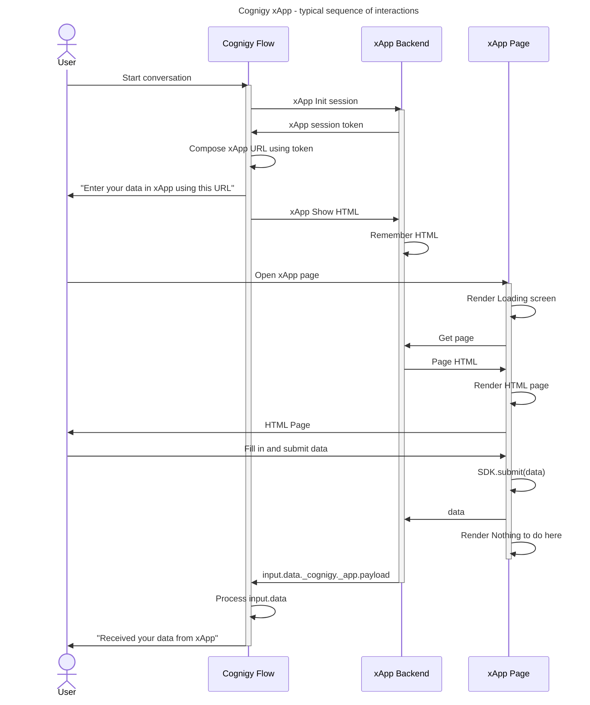

# xApp Architecture

1. The user starts a conversation with Cognigy Flow.
2. Cognigy Flow initializes a session with the xApp backend.
3. The xApp backend responds with a session token.
4. Cognigy Flow composes a URL using the session token and sends it to the user.
5. Cognigy Flow sends a request to the xApp backend to show the HTML page.
6. The xApp backend remembers the HTML page.
7. The user opens the xApp page.
8. The xApp page renders a loading screen.
9. The xApp page requests the HTML page from the xApp backend.
10. The xApp backend responds with the HTML page.
11. The xApp page renders the HTML page.
12. The user fills in and submits data.
13. The xApp page submits the data to the SDK.
14. The SDK sends the data to the xApp backend.
15. The xApp backend processes the data and sends it to Cognigy Flow as input.
16. Cognigy Flow processes the input data.
17. Cognigy Flow sends a message to the user confirming the data has been received.
