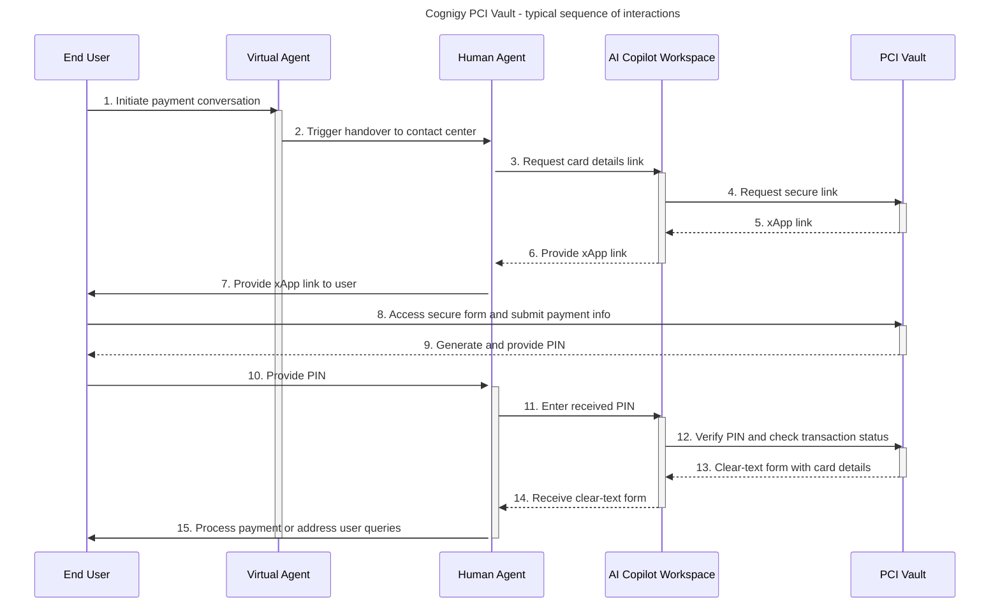

# PCI Vault

_PCI Vault_ is a specialized solution designed by Cognigy for contact center staff
to securely collect confidential information from end users,
including credit card details.

Cognigy PCI Vault is extensively audited to meet the _[PCI DSS](https://en.wikipedia.org/wiki/Payment_Card_Industry_Data_Security_Standard)_
(Payment Card Industry Data Security Standard) guidelines.
The PCI DSS standard establishes a comprehensive framework of requirements to protect cardholder data.
These mandatory standards apply to all entities engaged in processing data from major payment systems such as Visa,
MasterCard, American Express, and JCB.
In the [Cognigy Trust Center](https://trust.cognigy.com/),
you can view our [PCI DSS v3.2.1 compliance certificate](https://trust.cognigy.com/overview/05e85d7e-e354-413e-853f-a95b217c0e85/pci-dss),
showcasing our commitment to top-notch security.

PCI Vault is a shared SaaS (Software as a Service)
product and can be utilized only if you have shared or dedicated SaaS Cognigy installations.
This application is used within AI Copilot. Thus, the capabilities of the PCI vault are available for various handover providers supported by AI Copilot, including Cognigy Live Agent, Genesys, 8x8, and others.

## Architecture

The PCI Vault application is hosted within a dedicated AWS (Amazon Web Services) account, a PCI DSS requirement that enhances security by minimizing the potential attack surface and isolating PCI Vault from other systems.

Within PCI Vault, two key components are crucial: `service-secure-forms`,
which is responsible for managing external interactions, and `Redis`, which is dedicated to in-memory storage.
The application ensures an extra layer of security through the [AES](https://en.wikipedia.org/wiki/Advanced_Encryption_Standard) (Advanced Encryption Standard),
making it a robust solution for managing and safeguarding sensitive payment-related information.

The image below represents a high-level interaction diagram with PCI Vault.
The PCI Vault application interacts with Cognigy.AI, the contact center,
as well as end users and human agents.

High-level description of the process:

1. An end user initiates a conversation with a virtual agent, expressing the intent to make a payment.
2. The virtual agent detects the user's handover request and triggers a handover to the contact center.
3. A human agent in the contact center receives the handover and engages with the user. 
4. The human agent uses the AI Copilot workspace to request a link to enter card details from PCI Vault.
5. PCI Vault generates a secure xApp link for the card details form and provides it to the AI Copilot workspace.
6. The human agent receives the xApp link. 
7. The human agent provides the xApp link to the end user. 
8. The end user accesses the secure form through the provided link, enters sensitive payment information, and submits it. 
9. PCI Vault receives the encrypted information from the user, temporarily storing it in the Redis database for security purposes. PCI Vault generates a PIN and provides it to the end user. 
10. The end user provides the generated PIN to the human agent. 
11. Using the AI Copilot workspace, the human agent enters the received PIN. 
12. PCI Vault verifies the PIN and checks the transaction status. 
13. If the PIN is correct and the transaction status is valid, PCI Vault provides a clear-text form with card details to the AI Copilot workspace. 
14. The human agent receives the clear-text form with card details. 
15. The human agent processes the payment or addresses any further user queries related to the transaction.

## How to Configure

To empower your human agents to securely access user card data via PCI Vault, configure the following resources:

- The Main Flow is created with a [Handover to Agent](../ai/tools/agent-handover.md) Node.
- AI Copilot is configured in a separate Flow. The [Copilot: SecureForms Tile Node](../ai/flow-nodes/ai-copilot/secure-forms-tile.md) must be added to this Flow.
- Contact Center Integration is set up. For example, [Cognigy Live Agent](../live-agent/overview.md) is selected as a handover provider.
- An Endpoint is created. It should include the Main Flow, Handover Provider, and the Flow for AI Copilot. We recommend using [Cognigy Webchat Widget](../ai/endpoints/webchat/webchat.md) for further testing of configuration in [Demo Webchat](../ai/endpoints/webchat/integrated-demo-page.md) mode.

## Test your Configuration

When the configuration is ready, test your workflow.
For the example below, Webchat Widget is selected as the Endpoint for testing via Demo Webchat, and Cognigy Live Agent is chosen as a contact center provider.

To test your configuration via Demo Webchat, follow these steps:

1. Open the Congnigy.AI interface. 
2. In the left-side menu of your Agent, click **Deploy > Endpoints**. 
3. On the **Endpoints** page, select the **Webchat** Endpoint that you have already created with the predefined configuration.
4. In the upper-right corner of the Endpoint editor, click **Open Demo Webchat**. 
5. Start a conversation in the chat. For example, `I would like to pay for the ticket`.
6. Perform a handover to a human agent. 
7. In the Live Agent interface, a human agent receives your message. On the right side of the conversation chat, the human agent will see the **Request payment information** button.
   <figure>
     
   </figure>
8. When the human agent clicks this button, a link for entering card details will be generated and sent to the chat. If the link is not received, the human agent can forward it manually.
   <figure>
     
   </figure>
9. In a new browser window, open the link to fill in the payment form and click **Submit**.
   <figure>
     
   </figure>
10. If you successfully submit the data, the browser will display a PIN that you need to send to the chat with the human agent.
    <figure>
      
    </figure>
11. The human agent will enter this PIN in the **Unlock Pin** field within the AI Copilot workspace.
    <figure>
      
    </figure>
12. If the user successfully submits the data, the human agent in the AI Copilot workspace will receive the card details. For security reasons, the card data can only be unlocked once and will disappear when switching to another conversation. The human agent must take immediate action.
    <figure>
      
    </figure>

Once the card details are received, the human agent can process the payment on behalf of the end user.

## More Information

- [AI Copilot Nodes](../ai/flow-nodes/ai-copilot/overview.md)
- [Endpoints](../ai/endpoints/overview.md)