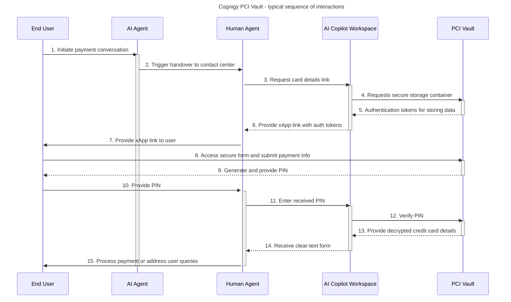

# PCI Vault

_PCI Vault_ is a specialized software solution designed for collecting end user credit card data during conversations with human agents in contact centers using our AI Copilot product. Cognigy PCI Vault is _[PCI DSS](https://en.wikipedia.org/wiki/Payment_Card_Industry_Data_Security_Standard)_
(Payment Card Industry Data Security Standard) compliant — a [PCI DSS v3.2.1 compliance certificate](https://trust.cognigy.com/overview/05e85d7e-e354-413e-853f-a95b217c0e85/pci-dss) is available in our [Cognigy Trust Center](https://trust.cognigy.com/).

PCI Vault is a shared SaaS product that can be utilized by Cognigy customers who have purchased the additional license. Please note that PCI Vault has a tight relationship with AI Copilot, and therefore is only available if AI Copilot has also been purchased. AI Copilot supports multiple Contact Centers.

## Architecture

Cognigy's PCI Vault is hosted in a dedicated AWS account running in Frankfurt, Germany. The product runs in a physically separated Kubernetes cluster. The image below represents a high-level interaction diagram with PCI Vault. The PCI Vault application interacts with Cognigy.AI, the contact center, as well as end users and human agents.

High-level description of the process:

1. An end user initiates a conversation with an AI Agent, expressing the intent to make a payment.
2. The AI Agent detects the user's handover request and triggers a handover to a contact center using the AI Copilot workspace.
3. A human agent in the contact center receives the handover and engages with the user.
4. The human agent uses the AI Copilot workspace and initiates the process to collect credit card data from the end user.
5. PCI Vault prepares a storage container and returns authentication tokens which will be used to store and retrieve the securely stored data.
6. The human agent receives an xApp link which will either automatically forwarded to the end user or which has to be forwarded manually by the human agent.
7. The human agent provides the xApp link to the end user.
8. The end user accesses the secure form through the provided link, enters sensitive payment information, and submits it.
9. PCI Vault receives the information from the user via an encrypted connection (HTTPS), encrypts it using AES and temporarily stores it in an in-memory storage. PCI Vault generates a PIN which is bound to the data which has been previously stored and provides it to the end user.
10. The end user provides the generated PIN to the human agent via a normal chat interaction.
11. Using the AI Copilot workspace, the human agent enters the received PIN.
12. PCI Vault verifies the PIN.
13. If the PIN is correct and the transaction status is valid, PCI Vault provides a clear-text form with card details to the AI Copilot workspace via an encrypted HTTPS secure connection.
14. The human agent receives the clear-text form with card details.
15. The human agent processes the payment or addresses any further user queries related to the transaction.

## How to Configure

To empower your human agents to securely access end user credit card data via PCI Vault, configuration of the following resources is a prerequisite:

- A Flow using the [Handover to Agent](../ai/build/node-reference/service/handover-to-agent.md) Flow Node to initiate a handover to a human agent.
- Handover with one of the supported Contact Centers is configured. An example might be the handover integration with [Cognigy Live Agent](../live-agent/overview.md).
- Usage of AI Copilot and the additional [Copilot: SecureForms Tile Node](../ai/build/node-reference/ai-copilot/secure-forms-tile.md) Flow Node which is used to initiate the entire credit card collection process.
- An Endpoint through which AI Copilot, the Handover Provider and respective Contact Center settings are configured.

## Test your Configuration

In the following example, we use the Webchat Widget, the Webchat Endpoint, and Cognigy Live Agent to demonstrate PCI Vault:

1. In the left-side menu of the Project, go to **Deploy > Endpoints**. 
2. On the **Endpoints** page, select the **Webchat** Endpoint that you have already created with the predefined configuration.
3. In the upper-right corner of the Endpoint editor, click **Open Demo Webchat**. 
4. Start a conversation in the chat. For example, `I would like to pay for the ticket`.
5. Perform a handover to a human agent. 
6. In the Live Agent interface, a human agent receives your message. On the right side of the conversation chat, the human agent will see the **Request payment information** button.
   <figure>
     
   </figure>
7. When the human agent clicks this button, a link for entering card details will be generated and sent to the chat. If the link is not received, the human agent can forward it manually.
   <figure>
     
   </figure>
8. In a new browser window, open the link to fill in the payment form and click **Submit**.
   <figure>
     
   </figure>
9. If you successfully submit the data, the browser will display a PIN that you need to send to the chat with the human agent.
    <figure>
      
    </figure>
10. The human agent will enter this PIN in the **Unlock Pin** field within the AI Copilot workspace.
    <figure>
      
    </figure>
11. If the user successfully submits the data, the human agent in the AI Copilot workspace will receive the card details. For security reasons, the card data can only be unlocked once and will disappear when switching to another conversation. The human agent must take immediate action.
    <figure>
      
    </figure>

Once the card details are received, the human agent can process the payment on behalf of the end user.

## More Information

- [AI Copilot Nodes](../ai/build/node-reference/ai-copilot/overview.md)
- [Endpoints](../ai/deploy/endpoints/overview.md)