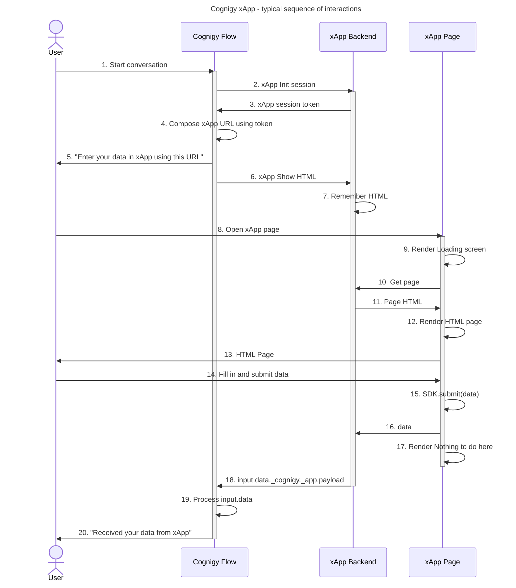

# xApp Architecture

The following diagram illustrates the process when the xApp Shell Page loads its assets (HTML/CSS/JS) by requesting static files via HTTP/HTTPs 1.1 requests to `service-static-files` and establishes a WebSocket connection (via Socket.io)  to `serviceapp-session-manager` to retrieve information about xApp sessions. This information includes an async event to initialize an xApp session, which creates a unique URL, and specifies which xApp will be displayed in a specific xApp session. The Elastic Load Balancer helps distribute incoming traffic, while Traefik dynamically routes traffic to backend servers based on specific requirements. The `serviceapp-session-manager` updates the xApp session state in the App Session DB, and the WebSocket transfers data to the Shell page, which loads xApps and provides data to the SDK.

<figure>
    
</figure>

## xApp Sequence Diagram

The diagram illustrates the sequence of interactions between a user, Cognigy Flow, xApp Backend, and xApp Page in the context of an xApp architecture integration.

1. The user starts a conversation with a Cognigy Flow.
2. The Cognigy Flow initializes a session with the xApp backend.
3. The xApp backend responds with a session token.
4. The Cognigy Flow composes a URL using the session token
5. The Cognigy Flow sends a message "Enter your data in xApp using this URL" to the user.
6. The Cognigy Flow sends a request to the xApp backend to show the HTML page.
7. The xApp backend remembers the HTML page.
8. The user opens the xApp page.
9. The xApp page renders a loading screen.
10. The xApp page requests the HTML page from the xApp backend.
11. The xApp backend responds with the HTML page.
12. The xApp page renders the HTML page.
13. The HTML page is shown to the user.
14. The user fills in and submits data.
15. The xApp page submits the data to the SDK.
16. The SDK sends the data to the xApp backend.
17. The "Nothing to do here" page is rendered.
18. The xApp backend processes `input.data._cognigy._app.payload` and sends it to Cognigy Flow as input.
19. The Cognigy Flow processes `input.data`. 
20. The Cognigy Flow sends a message "Received your data from xApp" to the user confirming the data has been received.

## More Information

- [Overview](overview.md)
- [Build an xApp](build/overview.md)
- [xApp Nodes](../ai/build/node-reference/xApp/overview.md)